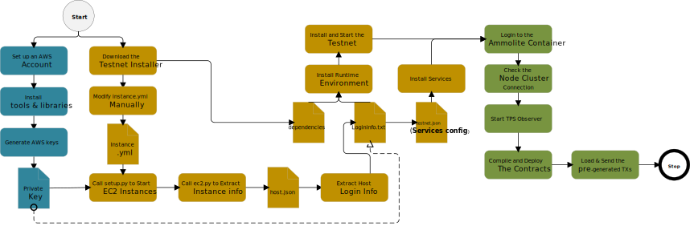
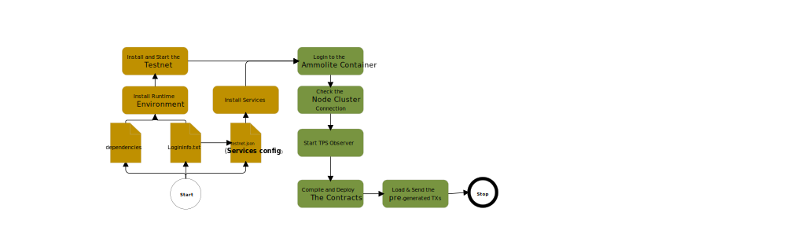

# Testnet Guide (v0.2)

- [Testnet Guide (v0.2)](#testnet-guide-v02)
  - [1. Introduction](#1-introduction)
  - [3. Getting Started](#3-getting-started)
    - [3.1 Major Steps](#31-major-steps)
  - [4. Prepare Hosting Machines](#4-prepare-hosting-machines)
  - [5. Set Up the Testnet](#5-set-up-the-testnet)
  - [6. Login to the Docker Image](#6-login-to-the-docker-image)
    - [6.1. Check the Connection](#61-check-the-connection)
    - [6.2 Use Pre-generated Transactions](#62-use-pre-generated-transactions)
    - [6.3. Upload the Transcation Files](#63-upload-the-transcation-files)
  - [7. Start Ammolite](#7-start-ammolite)
  - [8. Choose the Test Cases](#8-choose-the-test-cases)
  - [9. Overall Workflow](#9-overall-workflow)
    - [9.1. AWS](#91-aws)
    - [9.2. On Premises](#92-on-premises)

## 1. Introduction

The client software consists of multiple network services that can be deployed on multiple machines to achieve optimal performance. One of implications this type of design is increased complexicity. The testnet suite is a package containing all the necessary librares, python scripts and binary installers to make deployment and testing process easiler.

The suite is designed to facilitate these tasks:

1. **Deploy a testnet**
2. **Interact with the testnet**

Users with knowledge of python and blockchain should be able to start a testnet and take test runs with little effort.

## 3. Getting Started

A client consists of a number of network services communicating through MQ and RPC. In addition, these services are usually deployed on multiple machines to achieve better performance.

### 3.1 Major Steps


## 4. Prepare Hosting Machines

1. [On AWS](https://github.com/HPISTechnologies/aws-ansible)
2. On Premises

Once hosting machines are ready, you can start to set up the testnet

---

## 5. Set Up the Testnet

The hosting machines are ready by now, the next step is to set up node clusters on the hosting machine.
The [deployment](https://github.com/HPISTechnologies/deployments) project contains a set of tools to automate the process. Once testnet is live, it is ready to process transactions.  

## 6. Login to the Docker Image

The docker container has all necessary modules included to interact with the network. First, you need to login to the container.

```shell
ssh -p 32768 root@[Your docker‘s host IP]
```

- **Username**:   root
- **Password**:   frY6CvAy8c9E
 
> **gif image**

### 6.1. Check the Connection

The next step is to check the connection to the node cluster. You can find you frontend serivce ip from **testnet.json** file.

```python
$ python ./checkStatus.py [The frontend service ip]
```

> To benchmark the system with the maximum workload, please maintain a 10Gb connection between the Ammolite client and the frontend service.

### 6.2 Use Pre-generated Transactions

Benchmarking requires large volumes of transaction data, but generating transctions in realtime is a lengthy process taking a lot time. The installer package comes with some [preprepared transcation files](/pregenerated-txs.md) to facilitate testing.  

### 6.3. Upload the Transcation Files

---

## 7. Start Ammolite

To use [Ammolite](https://github.com/HPISTechnologies/ammolite), just start Python **in the docker image and import all necessary modules.**

```shell
$ python
```

## 8. Choose the Test Cases

The follow cases can run both interactively and programmatically

- [Token transfer](https://github.com/HPISTechnologies/parallel-coin-transfer)
- [Parallelized CryptoKitties](https://github.com/HPISTechnologies/parallel-kitties)
- [Parallelized dstoken](https://github.com/HPISTechnologies/ds-token)
  
> Please wait for one script to complete before starting the next one. The best way to tell is by looking at the number of transactions contained in the lastest block. The system has processed all transactions once it drops to zero(not rising from zero which shows the system is picking up speed).

## 9. Overall Workflow

### 9.1. AWS



### 9.2. On Premises


