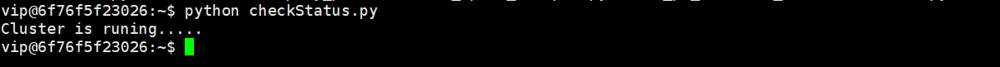
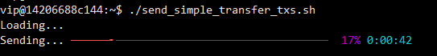

## Table of Contents 

- [Table of Contents](#table-of-contents)
- [1. Introduction](#1-introduction)
- [2. What's included in the Suite](#2-whats-included-in-the-suite)
- [3. Ammolite](#3-ammolite)
  - [3.1. Connect to the Node clusters](#31-connect-to-the-node-clusters)
  - [3.2. API](#32-api)
- [4. Getting Started](#4-getting-started)
  - [4.1. List of the files](#41-list-of-the-files)
  - [4.2. Check the cluster status](#42-check-the-cluster-status)
  - [4.4. Start Ammolite](#44-start-ammolite)
- [5. Interactive Examples](#5-interactive-examples)
  - [5.1. Token transfer](#51-token-transfer)
  - [5.2. Parallelized CryptoKitties](#52-parallelized-cryptokitties)
    - [5.2.1. Background](#521-background)
    - [5.2.2. Kitty Examples](#522-kitty-examples)
- [6. Performance Examples](#6-performance-examples)
  - [6.2. Start the performance observer](#62-start-the-performance-observer)
  - [6.3. Deploy ParallelKitties](#63-deploy-parallelkitties)
  - [6.4. Initialize PK test data](#64-initialize-pk-test-data)
  - [6.6. Test ParallelKitties' transfer function](#66-test-parallelkitties-transfer-function)
  - [6.7.  Test balance transfer between accounts](#67--test-balance-transfer-between-accounts)
- [7. Troubleshooting](#7-troubleshooting)

## 1. Introduction

The benchmarking suite is a package containing ready-developed python scripts to connect to a node cluster, send in simple and complex transactions and observer execution result and key performance information. It is easily enough for users with basic knowledge of python and some understanding in blockchain. The suite has some interactive examples to help to get familiar with the suite and a couple of batch examples for real performance benchmarking.

The followings are necessary for benchmarking:

- A network with **at least one active node cluster** running to interact with the suite
- A copy of benchmarking suite in a docker image
- A network connection between the benchmarking suite and the node cluster

## 2. What's included in the Suite

- A user guide file
- Credentials to log in to the environment
- [A docker file to create a docker image containing:](https://github.com/arcology-network/ammolite/blob/master/Dockerfile)
  - Linux environment with all required libraries installed
  - Tools to interact with the node cluster
  - Tools to **compile**, **deploy** and **invoke smart contracts** on the blockchain
  - Pre-generated data files with **2.5 million transactions** between  **5 million accounts** for Parallelized CryptoKitties
  - Pre-generated data files with **5 million transactions** between **5 million accounts** for token transfer
  - Scripts to send high volumne transction data to the node cluster
  

|File / Directory |    Description|
|---|---|
|accounts.txt                |A csv file contains accounts information that users can test in an interactive environment, the first column is the private key, the second column is the address, the third column contains the initial balances|
|config.yaml                 |A configuration file for deployment scripts used do not modify|
|contract                    |The source code folder for the Parallelized CryptoKitties|
|data                        |Pre-generated data files for performance benchmarking as generated large transaction data could be a lengthy process|
|deploy_pk.sh                |Deployment script for Parallelized CryptoKitties|
|deploy_v2.py                |A python script file called by deploy_pk.sh                 |
|double_spend_example.py     |An example to demonstrate how the system will detect and stop double spending in parallel mode. |
|send_init_txs.sh            |Initialization script for CryptoKitties. Performance benchmarking, call ./send_init_txs.sh directly|
|send_pk_transfer_txs.sh     |Scripts to  execute PK transfer, can only be used after Initialization|
|send_simple_transfer_txs.sh |Scripts for benchmarking coin transfer between 5M accounts|
|sendtxs.py                  |Loading in pre-generated transaction data and send into to a node cluster|
|simple_pk_example.py        |Interactive script for kitty transfer|
|simple_transfer_example.py  |Script file to test kitty transfer|
|tps.py                      |Script file used by tps.sh|
|tps.sh                      |TPS observer|
|utils.py                    |Utility functions|
|checkStatus.py              |Checking cluster status |

---

## 3. Ammolite

Ammolite is a collection of libraries implemented in Python that helps to interact with a full node through HTTP. Support for IPC or WebSocket will be added in the future. To start Ammolite, just start **python** and then **import necessary Ammolite modules**.

### 3.1. Connect to the Node clusters


### 3.2. API

The [Ammolite API](https://github.com/arcology-network/benchmarking/blob/main/ammolite-API.md) provides decriptions and some examples of how to write Python scripts to compile Solidty code and interact with a node cluster using [Ammolite](https://github.com/arcology-network/Ammolite) through HTTP interfaces.

> The docker image in the Benchmark comes with all the nessaray libraries and tools, so please don't try to reinstall them.

---

## 4. Getting Started

SSH into the container with the credentials provided

* **IP address**: xxx
* **Username**:   xxx
* **Password**:   xxx

### 4.1. List of the files


### 4.2. Check the cluster status

```python
$ python ./checkStatus.py
```



### 4.4. Start Ammolite

To start Ammolite, just start **python** and then **import necessary Ammolite modules.**

```shell
$ python
```

## 5. Interactive Examples

### 5.1. Token transfer

   1. [Simple Coin transfer](https://github.com/arcology-network/benchmarking/blob/main/Simple-Coin-Transfer-Example.md)
   2. When processing transactions in parallel mode, transactions are execute in totally isolated virtual machines. The [Double spending Prevention](https://github.com/arcology-network/benchmarking/blob/main/Double-Spend-Prevention-Example.md) shows how the concurrency framework prevents potential state inconsistency with a very typical case called [double spending](https://en.wikipedia.org/wiki/Double-spending)

### 5.2. Parallelized CryptoKitties

#### 5.2.1. Background

   1. [What is CryptoKitties](https://en.wikipedia.org/wiki/CryptoKitties)
   2. [How to parallelize CryptoKitties](https://github.com/arcology-network/benchmarking/blob/main/How-to-Parallelize-CryptoKitties.md)
   3. [The Concurrency framework](https://github.com/arcology-network/benchmarking/blob/main/concurrency-framework.md)
   4. [Parallelized CryptoKitties source code](https://github.com/arcology-network/ammolite/tree/master/examples/parallel_kitties)

#### 5.2.2. Kitty Examples

   1. [Simple Kitty transfer](https://github.com/arcology-network/benchmarking/blob/main/Simple-Kitty-Transfer-Example.md)

---

## 6. Performance Examples

To benchmark the system, we suggest you to use the pre-generated data file containing signed transctions in binary format. Generating large volumn of transactions is a very length process that usually takes a lot of time. The pre-generated data files are under the data directory.

> *Please wait for one script to complete before starting the next one. The best way to tell is by looking at the number of transactions contained in the lastest block. Once the number of transactions in the latest block drops to zero(not rising from zero which shows the system is picking up speed), it shows the system has processed all transactions.*

### 6.2. Start the performance observer

The performance observer gives realtime performance information for block height, number of transctions in each block, max TPS and average TPS over 60 seconds.
>Please note the observer only starts to output TPS when the node cluster is actively processing transctions

```shell
$ ./tps.sh
```


### 6.3. Deploy ParallelKitties

```shell
$ ./deploy_pk.sh
```


### 6.4. Initialize PK test data

```shell
$ ./send_init_txs.sh
```


### 6.6. Test ParallelKitties' transfer function

Benchmarking system performance with 2.5 million ParallelKitties transactions between 5 million user addresses

```shell
$ ./send_pk_transfer_txs.sh
```


### 6.7.  Test balance transfer between accounts

Benchmarking system performance with 5 million balance transfer transactions between 5 million user addresses

```shell
$ ./send_simple_transfer_txs.sh
```



---

## 7. Troubleshooting

In interactive mode, if you ran the code snippets provided in the documents and got unexpected results, the cause may be complicated. There are a couple of things you can do for a quick fix:

1. Check if the account you used to sign transactions has enough balance to pay the gas by calling *Cli.getBalance(address)*
2. Find another account from *~/accounts.txt* and try again.
