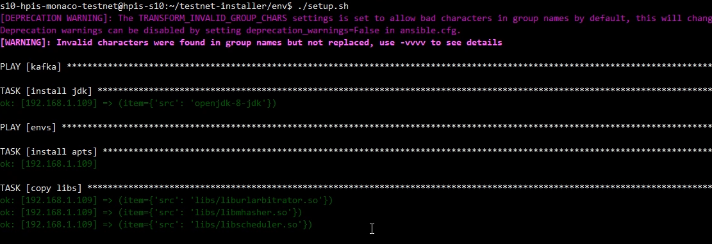
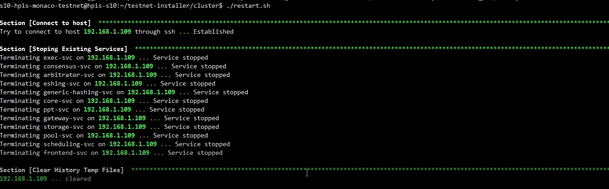

# All in One Installation Guide (v1.0.0)
- [All in One Installation Guide (v1.0.0)](#all-in-one-installation-guide-v100)
  - [1. Introduction](#1-introduction)
  - [2.Prerequisites](#2prerequisites)
  - [2. Installation](#2-installation)
    - [2.1. Download the Installer](#21-download-the-installer)
    - [2.2. The Package](#22-the-package)
This document shows how to start an all-in-one testnet one a local / remote machine.

## 1. Introduction

Arcology is a complex system, especially when it comes to the installation. Setting up the testnet is perhaps the most challenging step. Users often get confused about certain procedures.  

There is an all-in-one package in the testnet installer for beginners, which helps them to host all the services on a single machine. In many cases, it is going to be a notebook or workstation, so users won’t bother to go through the cluster setup process first, which is perhaps the most challenging step.  

The all-in-one installation option trades performance for installation easiness. But it is a perfectly fine option for a beginner to start with.

## 2.Prerequisites

- ubuntu 20.04
- Python 3.8.10

## 2. Installation

### 2.1. Download the Installer

Download the [latest installer package](https://github.com/arcology-network/benchmarking/releases) from Arcology’s GitHub repository, then uncompress the package into a directory *on the host machine* of your choice, making you have enough permission.

### 2.2. The Package

The installer package has the below structure
- `aws`  folder contains all the files to prepare clusters on Amazon AWS
- `env`  folder contains files and tools to install the envirment on a cluster of machines
- `cluster` folder  has the compiled Arcology service files and tools to start and stop a testnet
- `modifyconfig.sh`  is reposible to generate install configuraiton file based on user information
- `tools` folder has some miscellaneous tools for data preparation and cleaning.


1. Change directory into testnet-installer directoy

```sh
> cd testnet-installer
```

2. Modify environment configuration file with the command below

```sh
> ./modifyconf.sh yourhostip yourhostname yourhostpwd yourhostpath
```

For example, suppose your have the following login information

- Host machine ip: 192.168.1.109
- Host username: s9-hpis-monaco-testnet
- Host password: S9@Hpis.Monaco.Testnet
- Home directory on host: /home/s9-hpis-monaco-testnet/
  
3. Use the command below to update the installation files
```
> ./modifyconf.sh 192.168.1.109 s9-hpis-monaco-testnet S9@Hpis.Monaco.Testnet /home/s9-hpis-monaco-testnet/
```

4. Install Dependencies

```sh
> ./setup.sh
```



5. copy the pregenerated transaction files to the work folder

```
> scp -r ../txs s9-hpis-monaco-testnet@192.168.1.109:/home/s9-hpis-monaco-testnet/
```

6. Starting the Network

```sh
> ./restart.sh
```
 

7.ssh into the docker container

- Username: root
- Password: frY6CvAy8c9E

```sh
> ssh -p 32768 root@192.168.1.109
```
