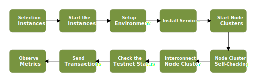

# AWS Benchmarking Plan

## 1. Introduction

This documents outlines some the key points about running a set of Arcology benchmark tests on AWS platform.

### 1.1. Current Blockchain Designs

One of major problems with all other major blockchain platform is the inability to take full advantage of modern multicore / multiprocessor architecture. Everything is strictly limited by the power of a single processor core.

### 1.2. Arcology Architecture

It is illusive that a single thread system will become the infrastructure of the future distributed world. It violates the law of physics, more tasks always mean more computational resource. Arcology is a systemic solution to address all the common challenges faced by the blockchain technologies today.

On Arcology, the overall throughput of the platform is proportional to amount of the resources invested. Arcology has the following revolutionary designs:

- Event-driven, asynchronous, microservice based Architecture
- Deterministic Concurrency Framework
- Cluster Computation
- Parallel Transaction Processing

There is always an upper limit on the number of cores that a single server can actually have. Apart of the multicore scenario, a further question is if Arcology can effectively expand to multiple servers.

### 1.3. AWS Fluctuation

We observed a few of times that aws machines didn't not give up constant 

---

## 2. Benchmarking

 Arcology is extremely flexible, so the configurations of individual nodes are completely transparent to other peers. The only notable different is the speed. To make the deployment process easier, We will divide the tests into 4 groups focusing on different aspects of Arcology’s scalability.

| |Testnet 1 | Testnet 2  |Testnet 3  |Testnet 4  |
|---|---|---|---|---|
|**A1**  |  1 x 1    |1 x 6   | 1 x 10  |1 x 20   |
|**A2**  |  3 x 1    |3 x 6   | 3 x 10  |3 x 20   |
|**B1**  |  10 x 1   |10 x 6  | 10 x 10 |10 x 20  |
|**B2**  |  24 x 1   |24 x 6  | 24 x 10 |24 x 20  |

> (Machines/Cluster) x (Number of Clusters)

### 2.1. Single Machine with Multiple Cores *(A1)*

In this test, we are going to start a testnet of multiple single-machine nodes. A single-machine configuration is where all the services are running on a single machine. The purpose is to see if Arcology is capable to fully utilize all the computational resources available on single computer with multiple cores.

### 2.2. Small Cluster with Multiple Cores *(A2)*

This test focuses on processing transactions on an Arcology testnet of small node clusters. Each node will typically consists of 3 ~ 4 machines.

### 2.3. Midsize Node Clusters *(B1)*

### 2.4. Large Clusters *(B2)*

So, in the multi-server test we are going to testnet consists of multiple clusters with large numbers of servers in each.

In this test case we will user machines with more cores , how number of vCPUs are going to affect the overall throughput.

---

## 3. Data

We will mainly use some smart contracts from Ethereum platform directly. The source code is all publicly available on github.com.

### 3.1. Smart Contracts

- [Coin transfer](https://github.com/arcology-network/parallel-coin-transfer)
- [Parallelized CryptoKitties](https://github.com/arcology-network/parallel-kitties)
- [dstoken mint](https://github.com/arcology-network/parallel-dstoken)
- [dstoken transfer](https://github.com/arcology-network/parallel-dstoken)

### 3.2. Transactions

A total of 2 million pre-generated transactions

---

## 4. Performance Data

### 4.1. Observation Tools

- AWS Cloudwatch
- Grafana

### 4.2. Performance Metrics

- Block Height
- Block Interval
- Total Transaction Processed
- Total Instances
- Total Memory
- Total Cores
- Total Bandwidth
- Peak TPS
- Realtime TPS

---

## 5. Steps

