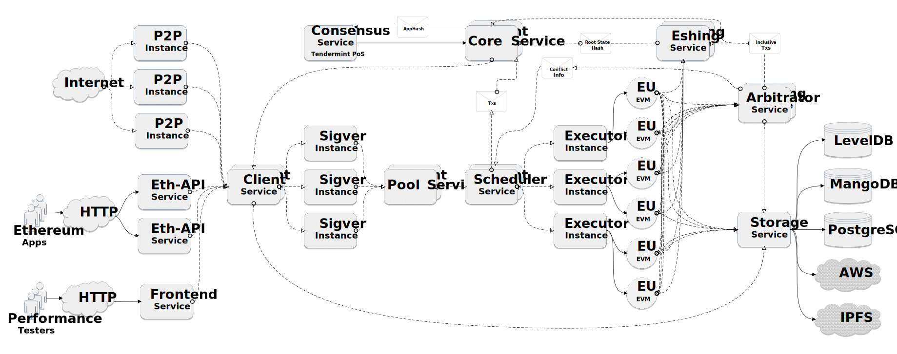
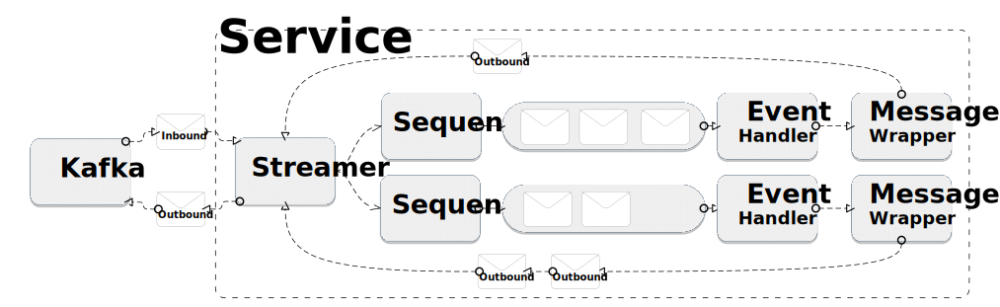
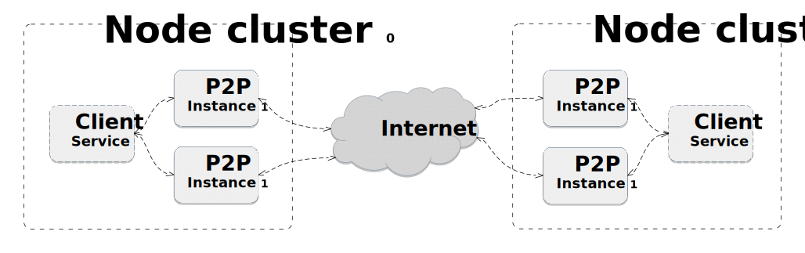
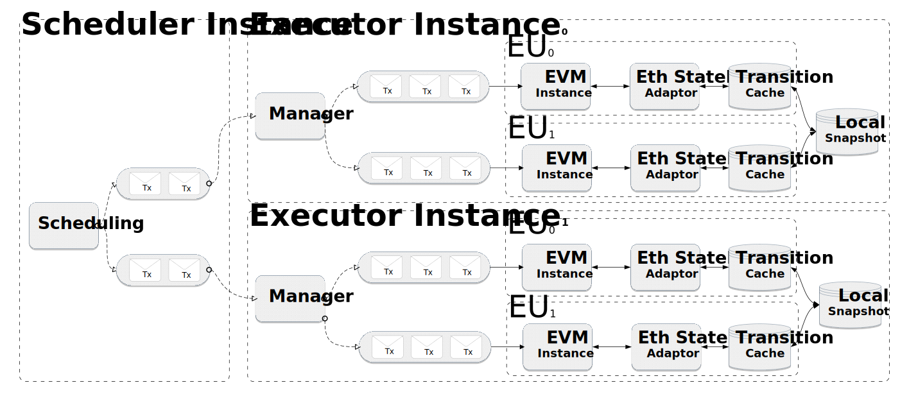
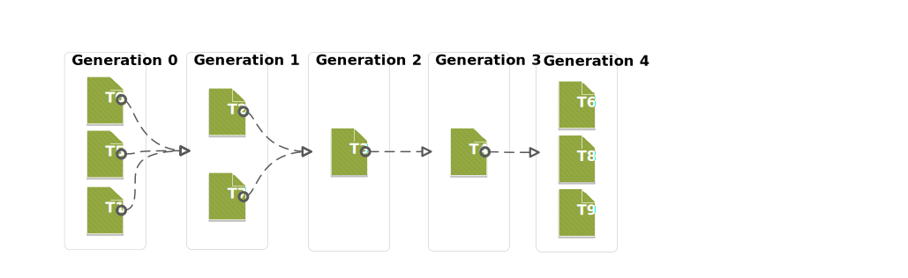
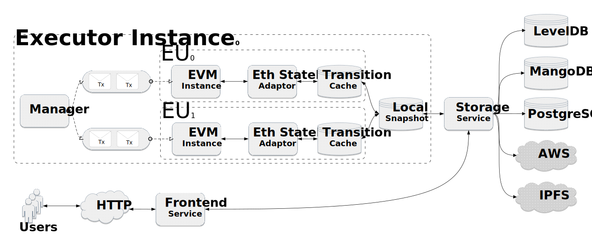

# Arcology Architecture Overview (v1.3.1)

This document covers some key features and the design considerations behind Arcology network. It isn’t designated to explain every single technical detail within the system, but rather to offer a big picture of the whole design characteristics.

- [Arcology Architecture Overview (v1.3.1)](#arcology-architecture-overview-v131)
  - [1. What is Arcology](#1-what-is-arcology)
    - [1.1. Parallel Processing](#11-parallel-processing)
    - [1.2. Composability](#12-composability)
  - [2. Architecture Design](#2-architecture-design)
  - [3. Cost and Complexities](#3-cost-and-complexities)
  - [4. Key Features](#4-key-features)
    - [4.1. EVM Compatibility](#41-evm-compatibility)
    - [4.2. L1 Parallel Transaction Processing](#42-l1-parallel-transaction-processing)
    - [4.3. Composability](#43-composability)
    - [4.4. Intra-node Scalability](#44-intra-node-scalability)
    - [4.5. Inter-node Scalability](#45-inter-node-scalability)
  - [5. Architecture](#5-architecture)
  - [6. System Hierarchy](#6-system-hierarchy)
    - [6.1. Node cluster](#61-node-cluster)
    - [6.2. Kafka](#62-kafka)
    - [6.3. Services](#63-services)
    - [6.4. Streamer](#64-streamer)
      - [6.4.1. Registration](#641-registration)
      - [6.4.2. Kafka vs Streamer](#642-kafka-vs-streamer)
    - [6.5. Sequencer](#65-sequencer)
    - [6.6. Event Handlers](#66-event-handlers)
    - [6.7. Message Wrapper](#67-message-wrapper)
  - [7. Service List](#7-service-list)
    - [7.1. Frontend](#71-frontend)
    - [7.2. Client service](#72-client-service)
    - [7.3. (TPP Service)(https://github.com/arcology-network/tpp-svc)](#73-tpp-servicehttpsgithubcomarcology-networktpp-svc)
    - [7.4. Pool service](#74-pool-service)
    - [7.5. P2P Service(https://github.com/arcology-network/p2p-svc)](#75-p2p-servicehttpsgithubcomarcology-networkp2p-svc)
    - [7.6. Core service](#76-core-service)
    - [7.7. Consensus service](#77-consensus-service)
    - [7.8. Executor Service](#78-executor-service)
      - [7.8.1. EU](#781-eu)
      - [7.8.2. EVM](#782-evm)
      - [7.8.3. VM Adaptors](#783-vm-adaptors)
      - [7.8.4. Transition Cache](#784-transition-cache)
      - [7.8.5. Transition Set](#785-transition-set)
      - [7.8.6. Local Snapshot](#786-local-snapshot)
      - [7.8.7. Execution Workflow](#787-execution-workflow)
    - [7.9. Arbitrator Service](#79-arbitrator-service)
    - [7.10. Eshing Service](#710-eshing-service)
    - [7.11. Scheduler Service](#711-scheduler-service)
    - [7.12. Storage Service](#712-storage-service)
      - [7.12.1. Embedded DB](#7121-embedded-db)
      - [7.12.2. Reduced Overhead](#7122-reduced-overhead)
      - [7.12.3. Decoupling](#7123-decoupling)
      - [7.12.4. Flexibility](#7124-flexibility)

## 1. What is Arcology

Arcology is the new generation of blockchain system utilizing parallel computation to solve some of the deeply rooted issues within current blockchain designs. It is foundationally different from many other blockchains in a number of ways.

In the centralized world, when there are scalability problems, Horizontal scaling an effective solution. If a single design cannot handle to workload, simply use multiple-threading. If one machine cannot live up to the task, just spread the workload to multiple machines. 

Today, virtually all blockchain projects have a monolithic design, (e.g., Geth for Ethereum) and can only be installed on a single machine. In short, the current blockchain designs fail to explore the benefits of horizontal scaling, a solution has been proven effective for the scalability issue.

### 1.1. Parallel Processing

Arcology has many inherent design advantages over other blockchain systems. One of the major benefits of Arcology is allowing multiple instances of the same functional module to work together sharing the workload.

### 1.2. Composability

Unlike other scaling solutions usually trade composabilty for some performance gain, smart contracts on Arcology are fully composable.  

## 2. Architecture Design

Arcology adpoted an event-driven, asynchronous microservice architecture. The goal is to have a new paradigm architecture for both permissioned and permissionless networks.

Arcology is a high-performance and general-purpose system that naturally demands a flexible, scalable and loosely coupled system architecture. All key functional modules can be horizontally scaled and new service can be integrated into the existing framework to fully harness the computational power that clusters offer.  The architecture has following benefits:

- **Cluster computing:**  High-performance of on a cluster of commodity computers
- **Horizontal scalability:** Resources are easily added by simply starting more service instances.
- **Loose coupling:** Key modules  are very loosely coupled, making development, testing and deployment much easier.
- **Asynchronous communication:**  Increaseed modularity and throughput.
- **Resources on demand:** User can fine-tune their cluster setup to meet specific needs on the fly.

## 3. Cost and Complexities

Operating cost certainly affects the level of decentralization. When it comes to the cluster computation, common myths are the cost and complexity. It seems to many that running a computer cluster is of out of reach of average users due to high cost and complexity.

In fact, setting up an Arcology cluster is very simple, the client installer package comes with a set of tools to facilitate the installation. There is no problem to install all the services on a single notebook. But if more resources are needed for much better performance, restarting an Arcology cluster will only less than 10 minutes.

Running a node cluster isn’t as expensive as it might look. A cluster of 6 machines can offer pretty impressive TPS, while will cost around $6k. In contrast, people will have to stake 32 eth to become an Ethereum validator, which is worth around $80k as of June 2021.

## 4. Key Features

 What Arcology offers is a framework that truly allows linear scalability. Arcology’s architectural design enables a lot of possibilities that other blockchain systems lack. Users can choose the most suited configuration based on their budgets and requirements.

On one hand, Arcology can be turned as a supercomputer-like, distributed computational infrastructure, in this case you can deploy hundreds of machines in each node cluster. On the other, users can run everything on a single notebook. This level of flexibility is only available on Arcology.  

Blockchain cannot magically break the laws of physics, higher TPS always mean more computational resources, the questions are where to get them and how to get them inexpensively.  

### 4.1. EVM Compatibility

Arcology has added EVM support because of its popularity. Smart contracts running on Ethereum can be moved  to Arcology smoothly with no modifications required at all. In fact, Arcology is inherently VM agnostic, it can work with any type of VM.

### 4.2. L1 Parallel Transaction Processing

Arcology is caplable of processing both simple transfers and smart contract calls in full parallel mode bring the scalability to the next level.

### 4.3. Composability

Composability is one of major challanges faced sidechain-based scaling solutions. Unlike the L2 solutions on Ethereum, smart contracts running on Arcology are fully Composable.

### 4.4. Intra-node Scalability

In Arcology, all key modules are provided as a network service. If these modules couldn’t handle the workload, the system will automatically start new instances to share the burden. The idea behind is simple, if one machine cannot handle the workload, just add more. With this design, increasing TPS becomes a matter of adding more processing cores, which is something very inexpensive to do these days.

### 4.5. Inter-node Scalability

One of major benefit Arcology Architecture provides is to allow both intra-node and inter-node scaling. Conventionally, a node is a single machine (physical/virtual) with one copy of client software installed. Arcology’s client software allows horizontal scaling, users can install one copy of Arcology client software on multiple machines.

## 5. Architecture

Arcology adopts an even driven, microservice based architecture. With a couple of exceptions, the services communicate through message brokers (Kafka). The majority of services in Arcology aren’t aware of each other. Arcology consists of a number of services, which can be organized
into 4 major groups.

- Consensus
- Transaction processing
- Communication
- Storage

## 6. System Hierarchy

In Arcology, there are a hierarchy of components working together to support the basic functionality of an Arcology client.

### 6.1. Node cluster

A node cluster is a combination of hardware and software environment that function as an independent entity on Arcology network. A node cluster to Arcology network is like a node to Ethereum network.

For other blockchains, a full node one piece of client software installed on one machine, either physical or virtual. But for Arcology, one copy of the client software consists of a number of independent services that can be installed on a cluster of machines connected by networks. Arcology network is a network of networks.

User can choose to install everything on a single machine. On the other hand, there is no upper limit on number of machines deployed in a cluster as long as the budget isn’t a big concern. Users have the freedom to customize their cluster configuration based on their needs.

### 6.2. Kafka

We used Apache Kafka to connect different services.  The services aren’t aware of each other. The broker is responsible for mediating majority of communications between major functional modules, which are just loosely coupled. Modules can be easily added, replace or upgrade without interfering with others.

### 6.3. Services

A service consists of a set of self-container functionalities that can be deployed, operated, and accessed through IP port. In Arcology, services primarily interact with each other through Kafka.  

A service subscribes from and publishes to a number of topics on Kafka and acts upon reception of different messages receive from MQ. Multiple instances of the same services may run together to share the workload. A service comprises of the following components:

- A MQ handle
- A Streamer instance
- A set of event handlers
- Sequencers and event wrappers

A running service receives messages from Kafka topics and forward them to its internal event streaming system name Streamer. The Streamer will be responsible for dispatching the messages to individual event handling threads called event handler for processing. Each Streamer instance controls a number of event handling threads that are listen to specific events to response to different events.

### 6.4. Streamer

Each service has a number of event handling threads running simultaneously. Streamer is an internal event manage system developed specifically for Arcology. Streamer isolates the consumer threads from the producer threads. Like the services, event handlers are completed unaware of each other.

- Managing event handlers
- Event handler registration
- Routing

#### 6.4.1. Registration

An event handler needs to register itself to a Streamer instance to receive and send events. Once the registration process is completed, the Streamer will start to pull events from Kafka topics and feed them to the target event handlers based on their registration information. There is many-to-many relationship between events and their handlers.

During the registration, the event handle will have the to provide the following information:

- Input and output event names
- Input and output buffer sizes
- Thread handle
- Message ordering information

Form handler’s prospective, once registration is completed, the way to interacts with other handlers on the same machine wouldn’t be different from talking to the ones on a remote machine thousands of miles away.

#### 6.4.2. Kafka vs Streamer

There are some conceptional similarities between Streamer and Kafka, but they have different focuses. Kafka only takes care of inter-service communication and doesn't know anything about how the messages should be handled.

In contrast, Streamer is more focused on the thread level and it provides more fine-grained control compared to Kafka. Furthermore, Streamer comes with some extra functionalities like sequencers and message wrappers to help event handlers to interact with Streamer.

### 6.5. Sequencer

An event handler may subscribe to multiple messages from multiple sources and these messages may arrive at any time. Sequencer's job is to properly reorder messages before forwarding them to the event handlers if necessary.

### 6.6. Event Handlers

Event handlers are the registered threads reside within services and triggered by individual event or event combinations. They are the ones to do the most of heavy lifting.  Event handlers can communicate with each other through Arcology Streamer. Each Streamer instance may own an arbitrary number of event handlers, but each event handler can only belong to one Streamer instance at a time.

### 6.7. Message Wrapper

Streamer only accepts messages in proper format. When a handler wants to produce an event, it needs to put the content in a event wrapper with the event name attached and send it back to the Streamer. Again, the message producing handler doesn’t know, neither does it care who are going to receive and consume the message. It is Streamer’s job to find the interested event handlers.

Once the messages are received, Streamer relay the them back to related Kafka topics if the recipients are in another service instance. If the recipients are in the same service, Streamer will forward the messages directly to corresponding event handlers.

## 7. Service List

An Arcology client software consists of a list of services. With a couple of exceptions, almost all the services are horizontally scalable. Below is a listed of the service at the moment.

| Service  | Description |
| --- | --- |
| Frontend        | Creating and maintaining connections with the end users through network connections |
| Client | Summarize requests from multiple frontend services, prioritize responses |
| Pool | Transaction pool |
| Sigver          | Transaction signature verification service, multiple instances suggested |
| P2P             | Communicate with peers, manage connections, maintain P2P connection, answering various types of requests  |
| Core            | The core service is responsible for making new blocks, validate blocks from other nodes  |
| Consensus       | Consensus module  |
| Scheduler       | Execution scheduler, dealing with executor services, optimizing transaction execution plans |
| Executor        | Transaction execution service, each instance contains multiple EUs |
| EU              | Execution Unit, Generic wrapper for platform dependent VMs |
| Eshing          | Merkle proof generator Answering Merkle proof requests|
| Storage         | Data storage module |
| Arbitrator      | Detect access conflicts during transaction execution process |
| Eth-api         | Service to support all the standard Ethereum JSON API RPC interfaces|
| Streamer        | Universal event management system|
|||

> Please note that Arcology is under active development, services above may change in the future.

### 7.1. [Frontend](https://github.com/arcology-network/frontend-svc)

The frontend service is responsible to establish and maintain connections with the end users through network connections. Frontend service is the gateway for users to interact with an Arcology node. There can be multiple frontend services to answer large volumes of user requests if necessary. The frontend supports the following functions at the moment.

- Submit transactions
- Query Receipts
- Query Blocks
- Request Merkle proofs  

As of Arcology version 1.0, only HTTP is supported for now, support for other protocols will be added in the future release.

### 7.2. Client service  

The Client service is the entry point for all transactions entering an Arcology node cluster. Usually, most of the transactions are coming either from the end users or the network peers.

The service ensures that no transaction will enter the node cluster twice. In addition, the client service will impose inbound request throttling when the pressure exceeds node cluster’s processing capacity. The service determines what transactions will finally enter processing workflow.

### 7.3. (TPP Service)(https://github.com/arcology-network/tpp-svc)

TPP is the signature verification module responsible for checking the transactions before sending them to the pool service. Signature verification could be a serious bottleneck when processing large volumes of transactions. So in general, multiple instances will certainly help with overall performance.

### 7.4. [Pool service](https://github.com/arcology-network/pool-svc)

The pool service keeps a set of transactions waiting to be processed internally. When a new block starts, the service will pick a list of transactions based on a set of selection strategies and then send the transactions to the scheduling service for execution planning.

### 7.5. P2P Service(https://github.com/arcology-network/p2p-svc)

 To make the network fully decentralized, there have to be multiple nodes / node clusters. Nodes need to talk to each other frequently to keep the network moving. Obviously, there will be a lot of communication going on in the process, which consumes a lot of bandwidth. Another factor having an impact on the communication is the number of nodes / node clusters.
 
 The overall bandwidth requirement is pretty much determined by the number of validator nodes and the data volume. With a slow network connection, even if a node can process enough transactions, the overall network TPS won’t be high enough because of the communication overhead.  The network communication is another major factor that determines network throughput.

Arcology allowing binding multiple P2P services together to work around the bandwidth limit. This feature is especially useful in cloud environment. On platform like AWS, there is an upper limit on how much bandwidth each machine can have.

For example, an Arcology node cluster can dynamically start 4 instances of the P2P services and have them deployed on 4 machines. If one machine has 5G of bandwidth, by combining 4 machines together, there is a total bandwidth of 5G x 4 = 20G.

The P2P service  can dynamically adjust itself connections according to the bandwidth requirement and network status.

### 7.6. [Core service](https://github.com/arcology-network/core-svc)

The core service is the bridge between the consensus algorithm, which mainly deals with external parties and the transaction processing procedures whose role is more internal. From the consensus service’s prospective, the core service is the only party it needs to interact with in terms of transaction processing.

The Core service is mainly responsible for making new blocks and coordinating related services to answer various types of requests from the consensus service through a set of standard interfaces. The Core isn’t aware of specific consensus algorithms used within the consensus service.

### 7.7. [Consensus service](https://github.com/arcology-network/consensus-svc)

The Consensus service is generalization of different consensus algorithms. The service communicates and interacts with other services via a set of standard network interfaces. 

The consensus part is only very loosely coupled with the rest of the system. The specific consensus algorithmn used within the service is completely invisible from outside. The underlying algorithm can be replaced or updated independently from other services or the overall workflow. It is pretty much plug & play ready.

Arcology will use its own consensus algorithm named multifactor, which can be seen as an upgraded version of the conventional PoS. For now, Arcology is using a customized version of **Tendermint** PoS on the testnets, with some major optimizations to the original consensus workflow. The efforts have been focused on following aspects:

- Allowing parallelization between the proposer and validators
- Proposed blocks compression
- Fine-grained locks for validator state synchronization
  
> Arcology will move to its own consensus algorithm called multifactor in the future. Please check out Arcology’s whitepaper for more details.

### 7.8. [Executor Service](https://github.com/arcology-network/exec-svc)

The scheduler connects to a network service called the Executor service. It is where the real transaction processing takes place. Depending on configuration, an Arcology node cluster may have a number of Executor instances running in parallel to process transactions. Each executor comprises the following components

- Generalized virtual machine instances called EU
- A state snapshot shared by all member EUs
- A VM adaptor to bridge VM and the state storage

> Like many other key components in Arcology, the executor service supports horizontal scaling. An executor may start an arbitrary number of EUs. However, in general, the number of EUs each executor has shouldn’t exceed the number of processing cores available on the machine. Adding too many EUs in a single executor service may deteriorates overall performance.

#### 7.8.1. EU

To achieve VM neutrality, all VMs in Arcology are abstracted as EUs(Execution Unit). EU is an abstraction of a state machine dedicated to transaction processing. Arcology is VM agonistic, an EU may have any type of VM inside. Different EUs are running completely in isolation. Any state change made by on EU wouldn’t visible to others during the execution process.  

This design allows multiple heterogenous VM to work on the Arcology. All it takes is to implement necessary adaptor modules on a platform-by-platform basis. A VM container consists of the following major parts:

- A native VM instance, e.g. EVM
- A StateDB adaptor with Arcology’s concurrent interfaces
- A transition cache to record all the state transitions
- A shared state snapshot handle

On Arcology, Arcology’s EU support all functionalities of the original ones with some extra features. Developers can still use the tools and libraries they have on the native platforms and the experience wouldn’t be any different from the original VM.

#### 7.8.2. [EVM](https://github.com/arcology-network/evm)

EVM support has been added to Arcology already for its popularity. Support for more VM types will be added in the future. There are some changes we made to the original EVM implementation to help it work with Arcology smoothly.

- **stateDB Interface:** In the original implementation, EVM access state data through the stateDB interfaces, which are native to Ethereum. We implemented a set of StateDB compatible interfaces to bypass original ones. The new adaptor redirects state accesses to the Arcology state storage instead.

- **Arcology concurrent programming:** Arcology has a library to help with concurrent programming in native solidity. The library provides functions wrapped as native solidity smart contracts deployed at some reserved addresses. The EVM adaptor intercepts  invocations to these special smart contracts and redirect them to the Arcology's handling procedures.

#### 7.8.3. [VM Adaptors](https://github.com/arcology-network/vm-adaptor)

The VM adaptors bridges the gap between native VM and Arcology platform. To work with Arcology, each type of native VM must implement its own StateDB. In many cases, supporting a new VM type only involves in implementing a new state access adaptor and some having abilities to access Arcology’s concurrent library.  

#### 7.8.4. Transition Cache

During the transaction processing, the stateDB adaptor records all state accesses from VMs and temporarily stored them in the transitions cache. When there is state access attemp, the EU always tries to read the latest states from the transitions cache first. EUs only access the local snapshot if there is a cache miss happened at the EU level.

When execution is done, the transition cache will export the all the records it has collected during execution process and save them is a special data structure called transition set. Eventually, the transitions set will be sent to the Arbitrator asynchronously for conflict detection. The transition cache will be reset by the end of each execution cycle.

#### 7.8.5. Transition Set

The transition set contains the information connecting state accesses to the transitions. It basically tells the Arbitrator which transactions have made what state accesses.

#### 7.8.6. Local Snapshot

Every executor instance comes with a state snapshot to provide high speed state access. States transitions are recorded in local state cache, before persists to the permanent storage. The process is transparent to Data storage users. The snapshot will talk to the storage service if there is a cache miss. 

The local state cache update itself at the end of each blocking cycle.

#### 7.8.7. Execution Workflow

The workflow below illustrate the major steps involved in the transaction execution.

1. When a new block begins, the scheduler service will receive a batch of transactions from the pool service for the current block

2. The Scheduler service will look into the transactions and based on their conflict history to create an execution plan.

3. The transactions will be dispatched to individual executor services based on the execution plan.

4. Upon reception of transactions, the executor service will further divide these transactions into subgroups and pack the transaction groups together with other necessary information into a series of events. Finally, the events are pushed to the Streamer.

5. The event handlers, which are EUs in the case, will receive the events and initialize new VM instances, for example EVMs, to process the transaction.

6. Once the transactions are processed, the EUs will send results back to the Streamer as events and the Streamer will forward them to their subscribers.

7. During the execution process, the transition cache in the EU will record all the state transitions and then send the cached transitions back to Streamer once the execution is done.

8. The Arbitrator will scan through all the transitions for potential conflicts.

9. The transitions causing conflict will be reverted together with the changes they made.

10. The scheduler service will update its conflict history database based on newly discovered conflict pattern, if any.

### 7.9. [Arbitrator Service](https://github.com/arcology-network/arbitrator-svc)

The Arbitrator will collect all the transaction execution results and look for potential access conflict. The transactions causing conflicts will be reverted together with their state transitions. 
The Arbitrator service will send the conflicting transactions back to the scheduler service.  The whole process is completely deterministic. Arbitrator determines conflict status based on the following the following conflict model.
| Operation | Conflict |
|---|---|
| {Read, Read}   |  **&check;** |
| {Read, Write}  |  **&cross;** |
| {Write, Write} |  **&cross;** |
|||

>In the best scenario, a fully parallelized program with no conflict point can lead to virtually unlimited speedup, which is only a matter of computational resources available. The key to achieve maximum parallelizability is to avoid conflicts wherever possible.

### 7.10. [Eshing Service](https://github.com/arcology-network/eshing-svc)

Permissionless blockchains are dependent on Merkle proofs to verify the authenticity and integrity of blockchain data. In many other designs, for example Ethereum, the Merkle proofs and the actually state data are both stored in a Merkle tree and persisted in an embedded DB like LevelDB or RocksDB.  

The Merkle tree, as its names suggests,  stores the data items in a tree structure and the data accesses always start from the root node and then goes at the way down until the target leaf node is reached.  The data items in the tree are tightly bound with their Merkle proofs, state data updates always trigger a cascade of Merkle proof manipulations. 
This design certainly has its merits in some cases and is also relatively easy to implementation. In addition, the consistency between the state data and corresponding Merkle proofs is always guaranteed. 

There are some issues are well. Since the state data are stored in a Merkle tree, one simple query may involve in a number of extra steps. Performance wise, if the whole tree is in memory, even with all these unnecessary tree search steps, the access speed won’t be a big concern most of time. However, systems like Ethereum chose to store the tree in an embedded database for some practical reasons.  Interacting with database excessively may result in a lot of IOs, which are slow and expensive. 

Another issue with this design is that it doesn’t have bring direct benefit to improving the transaction processing efficiency. The Merkle proofs are mainly for external parties to verify data integrity, which is unnecessary internally.  When processing transactions, the VMs only need to access data items, not their Merkle proofs.  Because the state data from their Merkle proofs are Intertwined in a tree structure, it is impossible access them separately. Storing the state data in a Merkle tree only makes the process cumbersome and inefficient.

Finally this design it isn’t optimal for high frequency use because it doesn’t allow any type of concurrency. Basically, you cannot update or add more than one data item at a time, accesses have to be strictly sequential. It is a major bottleneck when dealing with may large volumes of access requests result from high TPS.

The Eshing service supports all types of Merkle tree related functionalities. Arcology also uses Merkle tree to protect data integrity, what make it different from many others is the ability to allow concurrent updates and the separation between state and the Merkle proofs.

In Arcology, the state data are stored and handled independently from the Merkle tree. The Eshing service only takes care of Merkle tree query and updates. The Merkle tree is purely a tree of hashes of the state data and it doesn’t contain any the state data themselves.

The VMs no longer need to work with the Merkle tree to retrieve or update states. It is storage service’s responsibility to interact directly with access requests from VMS. In addition, Arcology’s Merkle tree design provides high level of concurrency. The tree can be updated in batch mode, in which millions of hashes are added to the tree altogether at the end of each block cycle.

The Eshing service answers Merkle proofs queries from external parties.

### 7.11. [Scheduler Service](https://github.com/arcology-network/scheduling-svc)

The scheduler is responsible for allocating transactions, making optimal transaction execution plans, and managing resources available based on the execution strategy.

The scheduler first scans through all the transactions in the transaction pool for their characteristics and then divides them into subsets called generations. The whole transaction execution process may comprise a number of generations.

The calls made to the smart contract addresses marked as parallelizable either by the developer or the system will be placed in the first generation. The scheduler always tries to put as many parallel transactions as possible in the first generation for better performance. Then each generation is subdivided into batches. Eventually the transaction batches are sent to different EUs for execution in parallel.

Developers can either implicitly declare if a call to a smart contract address is parallelizable or let the system determine by trying parallel execution first to see if there is any conflict.

At the end of each block cycle, the scheduler service will update its internal conflict database based on conflict information detected by the Arbitrator service. If two smart contracts turns out to be conflicting with others, the system will avoid putting in the same generation in the future.

### 7.12. [Storage Service](https://github.com/arcology-network/storage-svc)

Blockchains generate different types of data that need to be persisted. Over the years, many different types of database systems have been developed to meet different use bases. In-memory databases usually offers the best performance in terms of access speed. But because of limited capacity, keeping everything in RAM isn’t always practical in reality. Cloud storage services  like Amazon S3 provides cost efficient options for achieved data at cost of access speed.

#### 7.12.1. Embedded DB

StateDB is where date get persisted in a node cluster. Most blockchains rely on embedded databases like LevelDB and RocksDB to store various types of data. Embedded databases are known for performance and shorter latencies. In addition, because everything is in one piece, there is little maintenance required. For example, Ethereum is stuff everything (Merkle tree, blocks, receipts etc. ) into a LevelDB instance in form of Merkle trees.

However, when network grows the storage becomes a big problem. First, embedded databases are difficult to scale once they are running out of storage space. Second, embedded databases are still not fast enough to support high TPS.
How projects like Ethereum organize their data further complicate the problem. Ethereum stores their data in a struct called Merkle tree together with related Merkle proofs.

Arcology used the storage service in place of stateDB. The storage service provides a set of standard interfaces for external parties to use. The actual database system is hidden behind these service interfaces to make the service vender-agnostic. The actual databases in the storage service only flat state data meaning the Merkle tree is no longer tangled with the state data. The eshing service will take Merkle proofs instead.

#### 7.12.2. Reduced Overhead

This design has some unique advantages. First, because of everything is hidden in the storage service, the  underlying database are completely decoupled with the data users.  An Embedded database instance is no longer the only choice. User can even choose to run multiple databases instances behind the service to fulfill different needs. 
Second, since the state data are no longer stored in the Merkle tree,  they could be retrieved and updated through a direct key value pair lookup, reducing search complexity from O(log⁡n) to O(1).

#### 7.12.3. Decoupling

An ideal DB system for blockchains has to meet a few seemingly contradictory requirements. There is hardly a one-size-fits-all solution. Arcology classifies the data into different categories and assign them to different databases based on their access frequency.

For example, access speed is paramount while executing a transaction. In contrast,  for the sake of cost cutting, it is best to put bulky and less frequently accessed data (i.e. old blocks and old receipts) into more cost-efficient storage solutions.

#### 7.12.4. Flexibility

There aren’t strict rules for how data should be categorized or exactly where they should be saved, the decision is up to users to decide based on their budgets and expectation on overall system throughput.  Performance-wise, putting all the data in a memory DB would certainly be a perfect choice. On the other hand depending solely on cloud storage is also perfectly possible.

