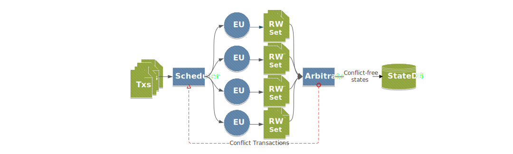

# Arcology Concurrent Framework

***V1.3 - 2022/1/9***

- [Arcology Concurrent Framework](#arcology-concurrent-framework)
  - [1. Introduction](#1-introduction)
    - [1.1. Nondeterministic Concurrency](#11-nondeterministic-concurrency)
    - [1.2. Deterministic Concurrency Framework](#12-deterministic-concurrency-framework)
    - [1.3. Design Goals](#13-design-goals)
    - [1.4. Arcology Concurrency Design](#14-arcology-concurrency-design)
      - [1.4.1. Horizontal Scaling](#141-horizontal-scaling)
      - [1.4.2. Homogeneous & Heterogenous](#142-homogeneous--heterogenous)
    - [1.4.3. Transparency](#143-transparency)
  - [2. Framework Overview](#2-framework-overview)
    - [1.6. Workflow](#16-workflow)
    - [2.1 Major Modules](#21-major-modules)
      - [2.1.1 Transaction Scheduler](#211-transaction-scheduler)
      - [2.1.3. Executor Service](#213-executor-service)
      - [2.1.4. Execution Unit](#214-execution-unit)
      - [2.1.5. RW Set](#215-rw-set)
      - [2.1.6. Arbitrator](#216-arbitrator)
    - [2.2. Tools](#22-tools)
  - [3. Data Structures](#3-data-structures)
    - [3.1 Counter Example](#31-counter-example)
    - [3.2. Counting with Concurrent Variables](#32-counting-with-concurrent-variables)
  - [4. Multi-Phrase Execution](#4-multi-phrase-execution)
    - [4.1 Serial Counter Example](#41-serial-counter-example)
      - [4.2. Concurrent Queue with Deferred calls](#42-concurrent-queue-with-deferred-calls)
    - [4.3. Key to Code Parallelization](#43-key-to-code-parallelization)
  - [6. Concurrent Interface](#6-concurrent-interface)
    - [6.1. Features](#61-features)
    - [6.2. Concurrent Containers](#62-concurrent-containers)
      - [6.2.1. Concurrent Array](#621-concurrent-array)
      - [6.2.2. Concurrent Queue](#622-concurrent-queue)
      - [6.2.3. Concurrent HashMap](#623-concurrent-hashmap)
    - [6.3. Serialization / Deserialization](#63-serialization--deserialization)
    - [6.4. System Contract](#64-system-contract)
    - [6.5. UUID (Universally Unique Identifier)](#65-uuid-universally-unique-identifier)
  - [7. Solidity Examples](#7-solidity-examples)
    - [7.1. BlindAuction](#71-blindauction)
  
---

## 1. Introduction

Scalability issue is the single biggest problem that blockchain networks face today. Among many contributing factors, low transaction processing capacity is a major one. Blockchain networks only use single thread to execute transactions.

Parallel programming is a well-studied area in computer science. It is is a very effective to solve large-scale problems. Applying the concept on blockchain will help solve the scalability issue.  More computational resources can be added to handle more workloads whenever needed. In addition, majority of programming languages today have some types of concurrent utilities allowing developers to write code to utilize multiple threads and to distribute the workload to multiple server relatively easily.

Despite the fact that multithreading is effective, there is no blockchain network that allows intra-node concurrent transaction processing yet. The reason is because that blockchain networks have some unique features that need to be properly addressed to make concurrent processing possible.

### 1.1. Nondeterministic Concurrency

Virtually all the multithread models on centralized systems today are on a first come, first served basis. Transactions are picked up and processed by the vacant threads at any time. Executing a set of transactions in different orders may generate completely different final state, which isn’t a problem for centralized systems.  However, in a public blockchain environment,  all the transactions will be processed by multiple nodes and these nodes need to end up with the same final state regardlessly, which is a property that most concurrency control mechanisms cannot guarante. Concurrency control designed for centralized systems wouldn’t work directly for blockchain networks.

### 1.2. Deterministic Concurrency Framework

For of issues mentioned above, there is a need for a blockchain focused concurrency control mechanism to coordinate the resources allocation, execution scheduling and conflict detection etc.  Arcology’s concurrency control mechanism is specially designed for blockchain with some specific focuses.

- Deterministic 
- Easy to use
- VM neural 
- High performance
- Flexible 
  
### 1.3. Design Goals

The framework is mainly focusing on helping developers eith parallelize the existing code or write new application on Arcology network. This document also provides some conceptual explanations in the system design processing. All the examples are in Solidity, as it is the first smart contract language Arcology supports, more language support will be added in the future.

### 1.4. Arcology Concurrency Design

Arcology concurrency control is a software-based mechanism specially designed for blockchain networks that manages and coordinates concurrent accesses to the shared resources on a single machine or multiple machines connected by high speed network. Arcology allows multiple transactions to be processed by multiple concurrent VMs hosted on different physical machines simultaneously and reverted ones that caused state inconsistency afterwards.  Arcology’s concurrency framework isn’t a traditional language level multithreading library. It is more focused on coordinating and controlling multiple virtual machine instances.

#### 1.4.1. Horizontal Scaling

Arcology manages the underlying hardware resources. All the transaction processing modules are provided as services that connected by high speed network. Modules that are doing computationally intensive jobs can be horizontally scaled up whenever needed.

#### 1.4.2. Homogeneous & Heterogenous

Arcology inherently allows multiple homogeneous and heterogenous VM running in parallel. This is achieved through a concept called generic VM container. A VM container is a general abstracted of a transaction processing unit. The specific types of VM running within VM containers are agonistic to the outside. As of this document, we have successfully built adaptors for EVM.

### 1.4.3. Transparency

Developer don’t need to be aware of hardware configurations or complexity of whole concurrency control mechanism. It is completely transparent to developers. Arcology provides a library to help smart contract developers to write concurrent code.   Original Ethereum smart contracts developed with solidity can run on Arcology smoothly with minimal effort necessary to fully parallelize their code.

---

## 2. Framework Overview

Arcology concurrency framework solves the problem of concurrent smart contract execution. Multiple calls to the same smart contract can be executed parallelly by multiple VMs on multiple machines, equipping the smart contract processing with ability to scale horizontally. In theory, there is upper limit on how much could be added to Arcology network, speedup is only a matter of computational resources available.

### 1.6. Workflow

At the beginning of the execution cycle,  each concurrent VM will have an independent copy of the state store. Updates to the state will by cached and total invisible to other VM instances during execution.  When all the transactions are executed, records of cached accesses will be put together for the conflict detection. Transactions causing potential conflicts will be reverted afterwards. Generally, a smart contract must be processed in serial mode as long as it contains some serial-only logic, even if the serial part only accounts for a tiny proportion of the whole program.

 
<p align="center"> Figure 1. Workflow  </p>


### 2.1 Major Modules


#### 2.1.1 Transaction Scheduler

Prior to execution, transactions are put into batches based on execution policies. Usually transitions related to the same applications would be grouped 

To achieve VM neutrality, all VMs on Arcology platform are abstracted as VM containers. The platform dependent implementations are capsulated within the container itself. Arcology currently supports EVM, more VM support will be added in the future. A VM container consists of the following major parts:

- A native VM
- Concurrent interfaces to bridge the native code logics with the VM Adaptors
- VM Adaptors to interact with the rest of Arcology concurrent framework
- A cache to record all the read and write attempts during the execution
- State snapshot
  
Among these major parts, only the VM interfaces are visible to the developers in form of a language specific library. Development experience wouldn’t be any different from the original VM platforms.
Apart from the obvious benefits of being much more compatible and portable, this design also allows multiple heterogenous VM to work on the same platform. All it takes is to implement necessary adaptor modules on a platform-by-platform basis. 

#### 2.1.3. Executor Service
To further expand scalability, a set of VM containers are group together and hosted as an Executor service instance that can be accessed remotely over the network.  There is no limit on number of VM contains each Transaction Execution can host or number of transaction execution instances available.

#### 2.1.4. Execution Unit

A VM container, when executing a transaction, is called an EU(Execution Unit). Different EUs are running completely in isolation. Different EUs may work on processing cores or even servers.  Any state change made by on EU wouldn’t visible to others during the execution process.  VM containers will reset to the default state after each execution.

#### 2.1.5. RW Set

RW set is a special data structure to record all the storage accesses initiated by the VM containers. At end of each transaction execution cycle, all the VM containers broad all the RW sets to other VMs as well the Arbitrator for conflict detection.

#### 2.1.6. Arbitrator

It is the arbitrator’s responsibility to detect and resolves concurrent or sometimes conflicting resource access requests from smart contract running in multiple EUs in parallel.  The arbitrator will protect data consistency by selectively revert transactions causing conflicts.  

### 2.2. Tools

There are many cases where access to global variables are inevitable.  On platforms like Ethereum, making a call to a deployed contract will always incur some transaction fees to be taken from the caller’s account balance, when the callers make multiple calls to the same or different contract in the same block, the caller’s account balance becomes a gloal variable in concurrent execution environment. Another example is some sort of global counters. A lot of smart contracts rely heavily on using counters to maintaining their internal logics.

In addition to an effective mechanism to prevent potential state conflicts, the framework offers a set of designs working together to help developers write concurrent code with easily. These include:

- Concurrent data structures
- Multi-phase execution
  
Arcology will also provide deterministic synchronization like Locks in the future. Unlike synchronization primitives available on most of programming languages, these primitives are strictly deterministic on Arcology.  

---

## 3. Data Structures

Many languages have implemented concurrent containers by employing some synchronizations behind the scenes to achieve atomicity, but theses containers are not necessarily deterministic. These concurrent contains correspond to Arcology’s synchronized containers except synchronized containers are strictly deterministic.

Arcology's concurrent container are specially designed data structures that allow concurrent read and write from concurrent VMs. It provides a language neural, fine-grain and much less invasive way for Arcology concurrency framework to work with different types of VMs.
They are different form native data containers like map and array in Solidity. Data in these containers are explicitly handled by the concurrent framework. Below are two simple examples demonstrating how to optimize code with shared variables to handle concurrent calls.

### 3.1 Counter Example

Many programs may need for a counter to count various type of events. For example, a simplest counter keeping track of number of calls to the smart contract may look like this:

```js
pragma solidity ^0.5.0;
contract VisitCounter {
    uint counter; 
    constructor() public {
      counter = 0;
   }
function Visit() public {
    // Do something else 
        counter += 1;
}   
}
```

In the contract above,  there is only one variable `counter`, which has an initial value of 0 and for each call to the interface `Visit`, the counter increments by one. This design is fine for serial execution but problematic for executing transactions in concurrent VMs.

For concurrent calls in multiple VMs running in total isolation, the modifications made are invisible to others. Unless there are some synchronization mechanisms, each VM only executes against the initial value of counter, which is zero.

As these are concurrent updates to a shared variable, only one transaction would go through, others would be simply discarded.

 
<p align="center"> Figure 2. Only one transaction takes effect</p>

### 3.2. Counting with Concurrent Variables

With Arcology concurrency control framework, there are multiple ways to implement a concurrent counter or other shared variables.  This simplest way is to declare a variable as cumulative. 
The example below implemented a concurrent counter through cumulative variable.  First step is to import a library called `ConcurrentLibInterface.sol`. Arcology concurrency framework is deployed at a set of special smart contracts. `0x90` is reserved for Cumulative variables.
Create a counter of type UINT256 and an initial value of 0. Each cumulative variable is identified by a unique variable name. Call interface `Add()` to , the cumulative variable counter is only visible within the contract in which it is declared.  

```js
pragma solidity ^0.5.0;
import "./ConcurrentLibInterface.sol";
contract ConcurrentVisitCounter {
Cumulative constant cumulative = Cumulative(0x90);
constructor() public {
    	cumulative.Create("counter", int32(ConcurrentLib.DataType.UINT256), 0);
}
    function Visit() public {
cumulative.AddUint256("counter", 1);
    }   
}
```

When multiple calls come in, all VM instances call their own `Add()`.  The increments will not take immediate effect after calling `Add()` until all transactions are executed. A post processing step will automatically add all the increments together and set the final value.


<p align="center"> Figure 3. All the transactions take delayed effect </p>

The code above is pretty self-explanatory. Cumulative variables are good for unconditionally increase or decrease a numeric value. However if some of code logics are dependent on the values of shared variables, cumulative variables are no longer a viable option.

---

## 4. Multi-Phrase Execution

Generally, a smart contract must be processed in serial mode as long as it contains some serial-only logic, even if the serial part only accounts for a tiny proportion of the whole program. While simple  parallelization isn’t always achievable. An alternative way is to reconstruct the code to separate the parallel from serial logics and wrapped them in two linked transactions executed in sequential order. This is referred to as multi-phase execution.

 

<p align="center"> Figure 4. Parallel executions with a deferred call</p>

In a multi-phase execution model, the parallel logics get executed first,  followed by a serial phase called deferred execution. The end state from the parallel phase is cached for serial part to continue the execution.  This design can help majority of smart contracts to gain dramatic performance speedup. 

### 4.1 Serial Counter Example

Programs usually have logics that could be executed in parallel and those that need to be handled in serial order.  Most programs are mixtures of both. A lot of programs contain logics that would modify some shared values one way or another.  
In the example below, instead of adding an increment to the counter, the counter itself would trigger an action to reset itself every 1024 calls.

```js
pragma solidity ^0.5.0;
contract VisitCounter {
    uint counter; 
    constructor() public {
      counter = 0;
}

    function Visit() public {
	if(counter == 1024) {
       counter = 0;
}
counter += 1;
    }   
}
```

A simple cumulative variable illustrated in the previous example lacks the ability to handle any customized action in the adding process. The above example couldn’t be called concurrently by simply declaring the counter as cumulative. In many cases, code couldn’t be simply parallelized by replacing some share variables. Parallelizing more complex cases would need more sophisticated tools. 
A solution would be using multi-phase execution. To help developers parallelize handling complex logics, Arcology provides another very useful concept called deferred call that link multiple phases together .

#### 4.2. Concurrent Queue with Deferred calls

A Deferred call is a mechanism designed to link the parallel and serial phase logically together. A deferred call enforces a serial execution point after parallel execution. A function called in the deferred execution phase is called a deferred function. Below is an example using the concurrent queue together with a deferred call to implement a counter.

```js
pragma solidity ^0.5.0;
import "./ConcurrentLibInterface.sol";
contract ConcurrentVisitCounter {
uint counter; 
ConcurrentQueue constant queue = ConcurrentQueue(0xa0); // queue manager

constructor() public {
  counter = 0;
  //system.createDefer("concurrentCounter", "CountVisits(string)");
  queue.create("cache", int32(ConcurrentLib.DataType.UINT256)); // declare a queue
}

function Visit() public {
   cache.pushUint256("cache", 1); 
   system.callDefer(CountVisits, "");  
}

function CountVisits(string memory callerName) internal {
uint256 length = queue.size("cache"); // get number of iterations
       for (uint256 n = 0; n < length; n++) {
           if (counter == 1024) {
       counter = 0
           } 
    uint256 delta = queue.popUint256("cache"); // pop from cache
           counter += delta;
       }
}   
}
```

In the example,  Address `0xa0` is reserved for the concurrent queue containers. There is no limit on number of queues declared as long as names are different. A concurrent containers must be declared first before use.

To make the counter concurrently callable, the original code snippet is divided into two parts. The first part is wrapped in the function `Visit()`, which takes in concurrent user calls and temporarily cache the changes in a concurrent queue for further processing. Adding data concurrently to a concurrent queue wouldn’t cause any conflicts. The value of `counter` remains unchanged in the process. At the end of the function body, a deferred function `CountVisits()` is called, which starts a shared instance of CountVisits() to execute against the state after the concurrent phase.

The second part is the serial phase, the function `CountVisits()` is called to retrieve all intermediate data generated by concurrently executed function `Visit()` and calculate the final counter value. In the serial phase, transactions are executed in sequential order, no conflict will ever happen.

### 4.3. Key to Code Parallelization

In the best scenario, a fully parallelized program with no contention point can lead to virtually unlimited speedup, which is only a matter of computational resources available. In the worst case, if all the transactions conflict with each, the design will be slower than serial execution. In practice, the key to achieve maximum parallelizability is to avoid contentions wherever possible.

Writing concurrent code can be tricky, the key is to find where the shared variables are.

---

## 6. Concurrent Interface

For developers, Arcology Concurrent Library is the gateway for smart contract to gain access to Arcology concurrency framework. Because of its non-intrusive design, the concurrent framework does not attempt to understand or add concurrent features to VM-native data structures or runtimes. Instead, it provides a set of system-level APIs deployed at special addresses called concurrent interface.


| Name	|Deployed Address|
|:-:|:-:|
| Concurrent  Array   	|0x80
| Concurrent  HashMap	|0x81
| Concurrent  Queue  	|0x82
| Concurrent  Variable	|0x83
| System	            |0xa1
| UUID	                |0xa0

Table 1. Deployment addresses

### 6.1. Features

The Concurrent interface is responsible for handling and redirecting smart contract logic with Arcology concurrency framework. At the core of the concurrent interface are the concurrent containers. The concurrent containers behave like concurrent data structures available in many programming languages with some fundamental differences:

- **Asynchronous:** All manipulations on the concurrent container made by multiple smart contract instances would only take final effect after successful execution.

- **Atomic:**  If a transaction is failed for whatever reason, all the changes made by the transactions during the executions will be reverted completely.  

- **Isolative:**  All transactions will be executed in complete isolation, changes made by one instance of a smart contract are invisible to other instances during the execution phase.

- **Consistent:** All the data elements in the concurrent containers are under protection of the framework, access that may cause unexpected consequences will be detected and reverted.

- **Lockless:** All concurrent containers are lockless, not dependent on synchronization primitives like locks to guarantee data consistency. 

- **Deterministic:** All the concurrent accesses and manipulations by multiple VM container instances are guaranteed to be deterministic at the system level. 
  
Concurrent containers need be to be declared through via concurrent manager prior to access. The smart contract can only access their own concurrent containers.

### 6.2. Concurrent Containers

Arcology supports Array, hash map and queue at this time, developers can choose based on their specific needs. The concurrent containers are designed to be language and platform neural; it is agnostic to UDTs (User-Defined Type). Arcology temporarily doesn’t support customized data types. Users need to do serialize and deserialize when dealing with their UDTs.  Currently, there are 3 supported data types, they are: 
- **ADDRESS**: Fixed length string of 20 bytes
- **UINT256**: Unsigned integer of 256 bites. 
- **BYTES**: Array of bytes.
In case of Solidity,  Arcology’s concurrent containers aren’t part of built-in Solidity data structures, they are defined with in a contract called ConcurrentLib. Below is the definition of ConcurrentLib.

```js
contract ConcurrentLib {
    /// @notice Enumerations of data type used in concurrent container
    /// INVALID 0 is not a valid data type
    /// ADDRESS address, 20 bytes
    /// UINT256 uint256
    /// BYTES   bytes, variable length byte array
    enum DataType {INVALID, ADDRESS, UINT256, BYTES}
}
```

#### 6.2.1. Concurrent Array
Concurrent Arrays are fixed-Length, one-dimensional data structure which are stored in the arrays accessed by their index numbers. The length of the concurrent arrays is defined at the declaration and couldn’t be changed at run time. When the max number of elements is known, concurrent array could be a good option.

```js
contract ConcurrentArray {
    /// @notice Create a new concurrent array, init every element to 0
    /// @param id Name of the array, should be unique in the contract it belongs to
    /// @param size Size of the array
    /// @param elemType Type of the array elements
    function create(string calldata id, uint256 size, int32 elemType) external;

    /// @notice Get the size of the array, cause an exception when the container id doesn't exist or index out of range
    /// @param id Name of the array
    /// @return size of the array
    function size(string calldata id) external view returns(uint256);

    /// @notice Get a specific element from an array containing addresses, cause an exception when the container id doesn't exist or index out of range
    /// @param id Name of the array
    /// @param index Index of the element
    /// @return value of the element
    function getAddress(string calldata id, uint256 index) external view returns(address);

    /// @notice Update a specific element in the array, cause an exception when the container id doesn't exist or index out of range
    /// @param id Name of the array
    /// @param index Index of the element
    /// @param value New value of the element
    function set(string calldata id, uint256 index, address value) external;

    /// @notice Get a specific element from an array containing uint256s, cause an exception when the container id doesn't exist or index out of range
    /// @param id Name of the array
    /// @param index Index of the element
    /// @return value of the element
    function getUint256(string calldata id, uint256 index) external view returns(uint256);

    /// @notice Update a specific element in the array, cause an exception when the container id doesn't exist or index out of range
    /// @param id Name of the array
    /// @param index Index of the element
    /// @param value New value of the element
    function set(string calldata id, uint256 index, uint256 value) external;

    /// @notice Get a specific element from an array containing byte arrays, cause an exception when the container id doesn't exist or index out of range
    /// @param id Name of the array
    /// @param index Index of the element
    /// @return value of the element
    function getBytes(string calldata id, uint256 index) external view returns(bytes memory);

    /// @notice Update a specific element in the array, cause an exception when the container id doesn't exist or index out of range
    /// @param id Name of the array
    /// @param index Index of the element
    /// @param value New value of the element
    function set(string calldata id, uint256 index, bytes calldata value) external;
}
```

#### 6.2.2. Concurrent Queue
A possible alternative to an array is to use Concurrent Queue, which is deployed at address 0x82.  The current behavior of Concurrent Queue is relatively simple, it only supports push to the end and pop from the front. It is more like a channel in some general-purpose programming languages.  It is especially useful when the order of elements being added to a data structure isn’t important. 

```js
  /// @param elemType Type of the element in queue
    function create(string calldata id, int32 elemType) external;

    /// @notice Get the size of the queue, cause exception if the container id doesn't exist
    /// @param id Name of the queue
    /// @return size of the queue
    function size(string calldata id) external view returns(uint256);

    /// @notice Append a new entry to the tail of the queue, cause exception if the container id doesn't exist
    /// @param id Name of the queue
    /// @param value The entry to append
    function pushUint256(string calldata id, uint256 value) external;

    /// @notice Remove the head entry from the queue, cause exception if the container id doesn't exist or the queue is empty
    /// @param id Name of the queue
    /// @return the entry removed
    function popUint256(string calldata id) external returns(uint256);

    /// @notice Append a new entry to the tail of the queue, cause exception if the container id doesn't exist
    /// @param id Name of the queue
    /// @param value The entry to append
    function pushAddress(string calldata id, address value) external;

    /// @notice Remove the head entry from the queue, cause exception if the container id doesn't exist or the queue is empty
    /// @param id Name of the queue
    /// @return the entry removed
    function popAddress(string calldata id) external returns(address);

    /// @notice Append a new entry to the tail of the queue, cause exception if the container id doesn't exist
    /// @param id Name of the queue
    /// @param value the entry to append
    function pushBytes(string calldata id, bytes calldata value) external;

    /// @notice Remove the head entry from the queue, cause exception if the container id doesn't exist or the queue is empty
    /// @param id Name of the queue
    /// @return the entry removed
    function popBytes(string calldata id) external returns(bytes memory);
}

```

#### 6.2.3. Concurrent HashMap

HashMap is an associative container for storing KV pairs. The value elements could be accessed directly with keys. The elements contained within HashMap are unsorted. Its key and value may have any data type supported by the concurrency framework. 
Directly Iterating through a HashMap to get all KV pairs isn’t supported right now but will be added in the future versions. An alternative is to save all keys in a separate data structure like array and use the keys to retrieve all the elements in the map when needed.

```js
contract ConcurrentHashMap {
    /// @notice Create a new hashmap
    /// @param id Name of the hashmap, should be unique in the contract it belongs to
    /// @param keyType Type of the key
    /// @param valueType Type of the value
    function create(string calldata id, int32 keyType, int32 valueType) external;

    /// @notice Get the value specified by key from a (uint256 => address) hashmap, cause an exception if the container id doesn't exist
    /// @param id Name of the hashmap
    /// @param key Key of the entry
    /// @return value or 0 if the key doesn't exist
    function getAddress(string calldata id, uint256 key) external view returns(address);

    /// @notice Update the value specified by key in a (uint256 => address) hashmap, cause an exception if the container id doesn't exist
    /// @param id Name of the hashmap
    /// @param key Key of the entry
    /// @param value The new value
    function set(string calldata id, uint256 key, address value) external;

    /// @notice Get the value specified by key from a (uint256 => uint256) hashmap, cause an exception if the container id doesn't exist
    /// @param id Name of the hashmap
    /// @param key Key of the entry
    /// @return value or 0 if the key doesn't exist
    function getUint256(string calldata id, uint256 key) external view returns(uint256);

    /// @notice Update the value specified by key in a (uint256 => uint256) hashmap, cause an exception if the container id doesn't exist
    /// @param id Name of the hashmap
    /// @param key Key of the entry
    /// @param value The new value
    function set(string calldata id, uint256 key, uint256 value) external;

    /// @notice Get the value specified by key from a (uint256 => bytes) hashmap, cause an exception if the container id doesn't exist
    /// @param id Name of the hashmap
    /// @param key Key of the entry
    /// @return value or an empty byte array if the key doesn't exist
    function getBytes(string calldata id, uint256 key) external view returns(bytes memory);

    /// @notice Update the value specified by key in a (uint256 => bytes) hashmap, cause an exception if the container id doesn't exist
    /// @param id Name of the hashmap
    /// @param key Key of the entry
    /// @param value The new value
    function set(string calldata id, uint256 key, bytes calldata value) external;

    /// @notice Delete the entry specified by key in a (uint256 => ?) hashmap in case the key exists, otherwise do nothing. Cause an exception if the container id doesn't exist
    /// @param id Name of the hashmap
    /// @param key Key of the entry
function deleteKey(string calldata id, uint256 key) external;
```

### 6.3. Serialization / Deserialization

Developers often may encounter situation where more complex data types are needed. User-defined data types like struct are much more flexible than the language built-in ones in many cases. 
Due to its language-neutral design philosophy, the concurrent framework doesn’t support user defined data types. Handling Customized data types are via serialization and deserialization.
The example below shows how to serialize a user defined data structure called Bid using a third-party library called Seriality, which is available at https://github.com/pouladzade/Seriality 

```js
pragma solidity >0.4.23 <0.5.0;

import "./ConcurrentLibInterface.sol";
import {Seriality} from "./Seriality.sol";

contract BlindAuction is Seriality {
    struct Bid {
        bytes32 blindedBid;
        uint deposit;
    }
    
    function bidToBytes(Bid memory bid) internal pure returns(bytes memory) {
        uint offset = 64;
        bytes memory buffer = new bytes(offset);
        bytes32ToBytes(offset, bid.blindedBid, buffer);
        offset -= 32;
        uintToBytes(offset, bid.deposit, buffer);
        return buffer;
    }
    
    function bytesToBid(bytes memory data) internal pure returns(Bid memory) {
        Bid memory bid;
        uint offset = 64;
        bytesToBytes32(offset, data, bid.blindedBid);
        offset -= 32;
        bid.deposit = bytesToUint256(offset, data);
        return bid;
    }
}
```

### 6.4. System Contract

System contracts are deployed to address 0xa1 and are primarily used to provide the Deferred Call and the related mechanisms.

```js
contract System {
    /// @notice: Bind a function to a defer call id
    /// @param id: The defer call id
    /// @param signature: The signature of the function
    function createDefer(string calldata id, string calldata signature) external;

    /// @notice: Call the deferred function specified by id
    /// @param id: The defer call id
    function callDefer(string calldata id) external;

    /// @notice Get the PID of the current transaction
    /// @return PID of the current transaction
    function getPid() external returns(uint256);

    /// @notice Revert all the modifications related to the specific PID
    /// @param pid The PID to revert
    function revertPid(uint256 pid) external;
}
```

### 6.5. UUID (Universally Unique Identifier)

UUID is a `thread-safe` way to generate a deterministic, pseudorandom and non-conflicting ID. With UUID, Concurrent HashMap can actually be used in place of variable-length arrays in many cases.

```js
contract UUID {
    /// @notice Generate a uuid base on the seed
    /// @param seed The seed used to generate uuid
    /// @return the uuid
    function gen(string calldata seed) external pure returns (uint256);
}
```

---

## 7. Solidity Examples

Many of the features and new concepts the concurrent library provides and introduce are unprecedented on all other blockchain platforms. Writing concurrent smart contract using Arcology’s concurrent framework might be a new experience for many developers. To help ease the learning curve, below are some examples to guide the developers through concurrent smart contract development. 

### 7.1. [BlindAuction](https://solidity.readthedocs.io/en/v0.5.12/solidity-by-example.html#blind-auction)

The example is a primarily demonstration of some concurrent containers. 
In this example, we will illustrate how to use serialization / deserialization utility function to store and access used-defined data types in a parallel container. The original implementation of this example is from the Solidity official documentation and for relative information please refer to https://solidity.readthedocs.io/en/v0.6.1/solidity-by-example.html#id2 

In the example, we used an open-source project for Solidity serialization / deserialization called Seriality (https://github.com/pouladzade/Seriality) to convert user-defined data types into byte array then backwards.  

```js
pragma solidity >0.4.23 <0.5.0;
import "./ConcurrentLibInterface.sol";
import {Seriality} from "./Seriality.sol";

contract BlindAuction is Seriality {
    struct Bid {
        bytes32 blindedBid;
        uint deposit;
    }
    
    function bidToBytes(Bid memory bid) internal pure returns(bytes memory) {
        uint offset = 64;
        bytes memory buffer = new bytes(offset);
        bytes32ToBytes(offset, bid.blindedBid, buffer);
        offset -= 32;
        uintToBytes(offset, bid.deposit, buffer);
        return buffer;
    }
    
    function bytesToBid(bytes memory data) internal pure returns(Bid memory) {
        Bid memory bid;
        uint offset = 64;
        bytesToBytes32(offset, data, bid.blindedBid);
        offset -= 32;
        bid.deposit = bytesToUint256(offset, data);
        return bid;
    }

    address payable public beneficiary;
    uint public biddingEnd;
    uint public revealEnd;
    bool public ended;

    //! mapping(address => Bid[]) public bids;

    address public highestBidder;
    uint public highestBid;

    // Allowed withdrawals of previous bids
    //! mapping(address => uint) pendingReturns;
    
    ConcurrentHashMap constant hashmap = ConcurrentHashMap(0x81);

    event AuctionEnded(address winner, uint highestBid);

    /// Modifiers are a convenient way to validate inputs to
    /// functions. `onlyBefore` is applied to `bid` below:
    /// The new function body is the modifier's body where
    /// `_` is replaced by the old function body.
    modifier onlyBefore(uint _time) { require(now < _time); _; }
    modifier onlyAfter(uint _time) { require(now > _time); _; }

    constructor(
        uint _biddingTime,
        uint _revealTime,
        address payable _beneficiary
    ) public {
        beneficiary = _beneficiary;
        biddingEnd = now + _biddingTime;
        revealEnd = biddingEnd + _revealTime;
        
        hashmap.create("bids", int32(ConcurrentLib.DataType.UINT256), int32(ConcurrentLib.DataType.UINT256));
        hashmap.create("pendingReturns", int32(ConcurrentLib.DataType.ADDRESS), int32(ConcurrentLib.DataType.UINT256));
    }

    /// Place a blinded bid with `_blindedBid` =
    /// keccak256(abi.encodePacked(value, fake, secret)).
    /// The sent ether is only refunded if the bid is correctly
    /// revealed in the revealing phase. The bid is valid if the
    /// ether sent together with the bid is at least "value" and
    /// "fake" is not true. Setting "fake" to true and sending
    /// not the exact amount are ways to hide the real bid but
    /// still make the required deposit. The same address can
    /// place multiple bids.
    function bid(bytes32 _blindedBid, uint256 num)
        public
        payable
        onlyBefore(biddingEnd)
    {
        //! bids[msg.sender].push(Bid({
        //!     blindedBid: _blindedBid,
        //!     deposit: msg.value
        //! }));
        uint256 key = uint256(keccak256(abi.encodePacked(msg.sender, num)));
        Bid memory b = Bid({
            blindedBid: _blindedBid,
            deposit: msg.value
        });
        bytes memory bidBytes = bidToBytes(b);
        hashmap.set("bids", key, bidBytes);
    }

    /// Reveal your blinded bids. You will get a refund for all
    /// correctly blinded invalid bids and for all bids except for
    /// the totally highest.
    function reveal(
        uint[] memory _values,
        bool[] memory _fake,
        bytes32[] memory _secret
    )
        public
        onlyAfter(biddingEnd)
        onlyBefore(revealEnd)
    {
        //! uint length = bids[msg.sender].length;
        //! require(_values.length == length);
        //! require(_fake.length == length);
        //! require(_secret.length == length);
        uint length = _values.length;
        require(_fake.length == length);
        require(_secret.length == length);

        uint refund;
        for (uint i = 0; i < length; i++) {
            uint256 key = uint256(keccak256(abi.encodePacked(msg.sender, i)));
            bytes memory bidBytes = hashmap.getBytes("bids", key);
            Bid memory bidToCheck = bytesToBid(bidBytes);
            (uint value, bool fake, bytes32 secret) =
                    (_values[i], _fake[i], _secret[i]);
            if (bidToCheck.blindedBid != keccak256(abi.encodePacked(value, fake, secret))) {
                // Bid was not actually revealed.
                // Do not refund deposit.
                continue;
            }
            refund += bidToCheck.deposit;
            if (!fake && bidToCheck.deposit >= value) {
                if (placeBid(msg.sender, value))
                    refund -= value;
            }
            // Make it impossible for the sender to re-claim
            // the same deposit.
            bidToCheck.blindedBid = bytes32(0);
            bidBytes = bidToBytes(bidToCheck);
            hashmap.set("bids", key, bidBytes);
        }
        msg.sender.transfer(refund);
    }

    /// Withdraw a bid that was overbid.
    function withdraw() public {
        //! uint amount = pendingReturns[msg.sender];
        uint amount = hashmap.getUint256("pendingReturns", msg.sender);
        if (amount > 0) {
            // It is important to set this to zero because the recipient
            // can call this function again as part of the receiving call
            // before `transfer` returns (see the remark above about
            // conditions -> effects -> interaction).
            //! pendingReturns[msg.sender] = 0;
            hashmap.set("pendingReturns", msg.sender, 0);

            msg.sender.transfer(amount);
        }
    }

    /// End the auction and send the highest bid
    /// to the beneficiary.
    function auctionEnd()
        public
        onlyAfter(revealEnd)
    {
        require(!ended);
        emit AuctionEnded(highestBidder, highestBid);
        ended = true;
        beneficiary.transfer(highestBid);
    }

    // This is an "internal" function which means that it
    // can only be called from the contract itself (or from
    // derived contracts).
    function placeBid(address bidder, uint value) internal
            returns (bool success)
    {
        if (value <= highestBid) {
            return false;
        }
        if (highestBidder != address(0)) {
            // Refund the previously highest bidder.
            //! pendingReturns[highestBidder] += highestBid;
            hashmap.set("pendingReturns", highestBidder, hashmap.getUint256("pendingReturns", highestBidder) + highestBid);
        }
        highestBid = value;
        highestBidder = bidder;
        return true;
    }
}
```

After the rewriting above, the method is fully parallelized. Since there is not attempt to update any global variables, it is safe to accept concurrent requests from different users or requests the same user with different input arguments.  

However, the `reveal` method is more complex. When executing `reveal`, if a bid price is higher than the current maximum price, the global variables `highestBid` and "highestBidder" are going to be modified, which may result in inconsistency problem. so the `reveal` methods cannot actually be executed in parallel. 
This is a typical problem that can be solved using the two-phase execution with help from a Deferred Call, which we will introduce in the example below

In the case of the `CryptoKitties` (=)), the counter is used to control the total number of gen0 kitties, promotion kitties, and all other kitties.  In the following example, we implemented a concurrent counter with a certain level of generality using the Deferred Call mechanism provided by concurrent library.  A similar approach can be used to solve the most the similar problem in the previous example.

```js
pragma solidity ^0.5.0;
import "./ConcurrentLibInterface.sol";

contract ConcurrentCounter {
    ConcurrentArray constant array = ConcurrentArray(0x80);
    ConcurrentHashMap constant hashmap = ConcurrentHashMap(0x81);
    ConcurrentQueue constant queue = ConcurrentQueue(0xa0);
    System constant system = System(0xa1);

    function create(string memory callerID, uint256 upperLimit) public {
        system.createDefer(callerID, "deferCount(string)");
        hashmap.create(callerID, int32(ConcurrentLib.DataType.UINT256), int32(ConcurrentLib.DataType.UINT256));
        array.create(callerID, 2, int32(ConcurrentLib.DataType.UINT256));
        array.set(callerID, 0, 0); // Index 0 stores the current count.
        array.set(callerID, 1, upperLimit); // Index 1 stores the upper limit of counter.
        // create a queue for the caller
        queue.create(callerID, int32(ConcurrentLib.DataType.UINT256));
    }
    
    function increase(string memory callerID) public {
        // get current process ID，queue。
        uint256 pid = system.getPid();
        queue.pushUint256(callerID, pid);
        
        int256 delta = int256(hashmap.getUint256(callerID, pid)); // get the corresponding counter value
        delta += 1; // increase by one
        hashmap.set(callerID, pid, uint256(delta)); // write back
      	system.callDefer(callerID); // link the current call with a deferred function
    }
    
    function decrease(string memory callerID) public {
        uint256 pid = system.getPid();
        queue.pushUint256(callerID, pid);
        
        int256 delta = int256(hashmap.getUint256(callerID, pid));
        delta -= 1;
        hashmap.set(callerID, pid, uint256(delta));        
        system.callDefer(deferredCount, callerID);        
    }
    
    function get(string memory callerID) public view returns(uint256) {
        return array.getUint256(callerID, 0);
    }
    
    function deferredCount(string memory callerID) public {
        int256 count = int256(array.getUint256(callerID, 0));  // get the latest count value
        uint256 upperLimit = array.getUint256(callerID, 1);   // get the upper limit

        uint256 length = queue.size(callerID); // get queue length for number of iterations
        uint256 n = 0;
        for (; n < length; n++) {
            // get the PID and use hashmap to get corresponding value changes
            uint256 pid = queue.popUint256(callerID);
            int256 delta = int256(hashmap.getUint256(callerID, pid));
            // roll back the transaction when out of range
            if (count + delta < 0 || int256(upperLimit) < count + delta) {
                system.revertPid(pid);
            } else {
                count += delta;
            }
            hashmap.deleteKey(callerID, pid); // Clear temporary data
        }
        array.set(callerID, 0, uint256(count)); // Update counter
    }
}
```

The code above removed some of the details that are usually required a production environment for simplicity. For example, the identity of the caller should be verified in all public methods because the owner of The Concurrent Counter may not want anyone to store their own count values in this contract.  
This contract is used as the following:

```js
// Pseudo code
// Create a new counter
ConcurrentCounter counter = ConcurrentCounter(addr);
counter.create("someCounter", upperLimit);

// Increase the counter by 1
counter.increase("someCounter");

// Decrease the counter by 1
counter.decrease("someCounter");
```

In the example above, all the increments and decrements happened concurrently. Different processes avoid reading or modifying the global count value during the parallel phase. Instead their simply put increments as intermediate values into a queue for the serial phase to process. If an increasement exceeds the upper limit, Deferred Call uses the transaction's PID to roll back the transaction as a whole. 
In many cases, a Deferred Call can achieve better performance compared to using the synchronization mechanism like locking.
