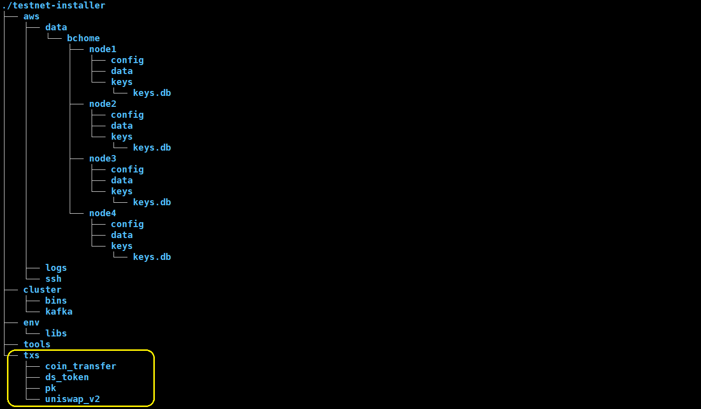

# Ammolite Client Docker Container

- [Ammolite Client Docker Container](#ammolite-client-docker-container)
  - [1. What Is Ammolite](#1-what-is-ammolite)
  - [2. Prerequisites](#2-prerequisites)
  - [3. The Package](#3-the-package)
    - [3.1.  Pregenerated Transactions](#31--pregenerated-transactions)
    - [3.2. Structure](#32-structure)
  - [4.  Work with the Client Container](#4--work-with-the-client-container)
    - [4.1. Start the Client Container](#41-start-the-client-container)
    - [4.2. Container Login](#42-container-login)
    - [4.3 Connect to a Node Cluster](#43-connect-to-a-node-cluster)
    - [4.3 Send the Transactions](#43-send-the-transactions)
  - [5. Showcases](#5-showcases)
  - [6. Note](#6-note)

## 1. What Is Ammolite

[Ammolite](https://github.com/arcology-network/ammolite) is Arcology's network client package written in Python. It can interact with Arcology nodes through HTTP connections. Ammolite to Arcology is like web3.js to Ethereum. The Ammolite client container is docker image with all the necessary modules and libraries installed to compile the solidity smart contracts and to interact with an Arcology testnet.

## 2. Prerequisites

The client docker is pretty much self-contained. You only the following items to start working with an Arcology testnet.

- An Arcology Testnet
- Docker Engine

## 3. The Package

The package consists of two major parts.

- A client docker container
- Pregenerated transaction files

### 3.1.  Pregenerated Transactions

The stand Arcology releases contain some pregenearted transaction files that can be used directly in testing. There files are not part of the client docker. You will need to get them from the installer package.

Download the latest installer, uncompress the package to a location of your choice, the folder structure should look like the below. There is a folder named `./testnet-installer/txs`, which containes all the pregenerated transaction files. **You will need to mount the folder to the client docker to continue the test.**



### 3.2. Structure

The docker image containes the following files and folders.

- blockmon.py: Realtime blockchain monitor
- checkStatus.py: Script file to check the testnet status
- data: Data folder for transaction files
- ds_token: Scripts and data files for ds_token showcase  
- parallel_kitties Scripts and data files for the parallel CryptoKitties showcase  
- python: The last python executable
- sendtx.py: Send trasactions to testnet 
- sendtx.sh: Shell wrapper for sendtx.py
- tps.py: Realtime TPS observer
- uniswap: Scripts and data files for uniswap showcase  
- utils.py: Utility tools

## 4.  Work with the Client Container

### 4.1. Start the Client Container

The following command starts the client container and mount the transaction data folder. Replace the folder `/home/testnet-installer/txs` with the directory where your pregenerated transitions reside.

```shell
sudo docker run --name ammo -p 32768:22 -v /home/testnet-installer/txs:/root/data  -d cody0yang/ammolite /usr/sbin/sshd  -D
```

### 4.2. Container Login

Run the command to log in to the container. Simply **replace `192.168.1.103` with your host machine IP.**  Again, the host is the machine on which the client docker is running.

```shell
ssh -p 32768 root@192.168.1.103
```

Use the credential below to log in to the client docker.

- Username:   **root**
- Password:   **frY6CvAy8c9E**

### 4.3 Connect to a Node Cluster

In the client docker container, type in the command below to check if the client docker is successully connected to an Arcology node cluster. Replace the IP `192.168.1.103` with the Arcology Node IP that you are connected to.

```shell
python checkStatus.py 192.168.1.103:8080
```

If the testnet is working normally you will see something like the below.


### 4.3 Send the Transactions

You will need to use `sendtxs.py` to load in a pre-generated transaction file and send transaction to an Arcology node through HTTP connections.

**Syntax:**

```sh
python sendtxs.py [NODE_IP:8080] [TRANSACTION_FILES]
```

The command above calls a python script file called `sendtxs.py` to load a pregenerated transaction file and then send it to an Arcology node through port `8080`.

## 5. Showcases

There are a few applications that are available on Arcology testnet. These cases are part of the client docker, so you may run the directly without having to install them manually.

- [Parallel Kitties](https://github.com/arcology-network/parallel-kitties/blob/master/parallel-kitties-test-scripts.md)
- [Parallel Dstoken](https://github.com/arcology-network/parallel-dstoken/blob/master/parallel-dstoken-test-scripts.md)
- [Uniswap v2](https://github.com/arcology-network/uniswap-testing/blob/master/uniswap-v2-test-scripts.md)
- [Parallel Coin Transfer](./parallel-coin-transfer.md)

## 6. Note

Please wait for one script to complete before starting the next one. The best way to tell is by looking at the number of transactions contained in the lastest block. The system has processed all transactions once it drops to zero(not rising from zero which shows the system is picking up speed.