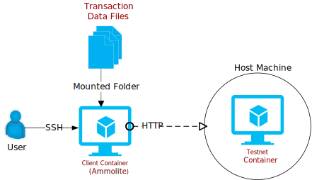
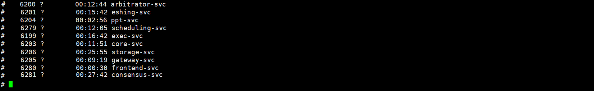

# All-in-One Testnet Docker Guide (v1.3)

- [All-in-One Testnet Docker Guide (v1.3)](#all-in-one-testnet-docker-guide-v13)
  - [1. Getting Started](#1-getting-started)
    - [1.1. Contents](#11-contents)
    - [1.2. System Requirements](#12-system-requirements)
    - [1.3. **Download the Testnet Container**](#13-download-the-testnet-container)
    - [1.4. **Start the Testnet Container**](#14-start-the-testnet-container)
    - [1.5. **Check the Testnet**](#15-check-the-testnet)
      - [1.5.1. Log in to the Testnet Container](#151-log-in-to-the-testnet-container)
      - [1.5.2. Check the Services](#152-check-the-services)
      - [1.5.3. Check the Connectivity](#153-check-the-connectivity)
    - [1.7. Stop the Testnet](#17-stop-the-testnet)
    - [1.8. Remove the Container](#18-remove-the-container)
  - [2. Interact with the Testnet](#2-interact-with-the-testnet)
    - [2.1. Using Ethereum Tools](#21-using-ethereum-tools)
    - [2.2. Using Ammolite](#22-using-ammolite)
  - [3. `Troubleshooting`](#3-troubleshooting)
    - [3.1. I Cann't See All the Services](#31-i-cannt-see-all-the-services)
    - [3.2. The Localhost Doesn't Work](#32-the-localhost-doesnt-work)
    - [3.3. Why Am I Receiving {"sysdbg":"block is nil"}](#33-why-am-i-receiving-sysdbgblock-is-nil)

## 1. Getting Started

The testnet docker container has virtually everything you need to get started. It is probably the easiest way to set up a testnet. THe docker engine is the only thing you will need other than the docker images.

### 1.1. Contents

There are three major components in the docker container package.

- A Testnet container
- A Client container
- Transaction data files

The transaction data files are pregenerated transaction data to facilite the test. They are part of the testnet installers, which need to be downloaded separately from **[here](https://github.com/arcology-network/benchmarking/releases)**



### 1.2. System Requirements

- ubuntu 20.04
- 2 Cores
- 16G RAM
- Docker Engine

### 1.3. **Download the Testnet Container**

```sh
sudo docker pull cody0yang/cluster:1.13
```

### 1.4. **Start the Testnet Container**

Use the the command below to start the testnet container and map the port `8080` to the host machine. You will need to use the host IP to access the docker container later. Remember, the host machine is the one on which your testnet docker is running. 

The port 7545 is for handling standard Ethereum json rpc calls so users can use the standard Ethereum tools like Truffle, Remix and MetaMask to connect.

```sh
docker run --name allinone-cluster -p 8080:8080 -p 7545:7545 -d cody0yang/cluster:1.13 /root/dstart.sh chainID:100 rpcPort:7545
```
> It will take some time for the services to start. Please wait for some time before proceeding to the next steps.

### 1.5. **Check the Testnet**

Your testnet docker should be listening on port 8080 and ready to be connected by know.

#### 1.5.1. Log in to the Testnet Container

 The next step is to check the testnet status to see if everything is running properly. First, you will need to log in to the testnet container with the command below.

```sh
sudo docker exec -it allinone-cluster /bin/sh
```

#### 1.5.2. Check the Services

Then, use these commands to check the if all the Arcology services are running. You can simply copy and paste them into your container console.

``` sh
ps -e | grep arbitrator-svc
ps -e | grep eshing-svc
ps -e | grep generic-hashing-svc
ps -e | grep tpp-svc
ps -e | grep scheduling-svc
ps -e | grep exec-svc
ps -e | grep core-svc
ps -e | grep consensus-svc
ps -e | grep storage-svc
ps -e | grep gateway-svc
ps -e | grep frontend-svc
ps -e | grep pool-svc
ps -e | grep eth-api-svc
```

If everything is in order, you should be able to see a list of Arcology services running in the testnet container, which should look like this.



#### 1.5.3. Check the Connectivity

The testnet container should be listening on port 8080 of your host machine already. To check if the testnet is reachable, paste the following line into your **host machine browser**. Replace the `localhost` address with the host IP, if you are connecting **from other machines.**
```sh
http://localhost:8080/blocks/latest?access_token=access_token&transactions=false
```

Aagin, you should see somthing like the blow.

```json
{
  "block": {
      "height":41285,
      "hash":"b2858fbefc496e844e1a7e8a0d2ee23afb8c18492f1ce694b70160fe96db7c47",
      "coinbase":"0x971Df33B1EFe022ec4173E61f1113C3887c08b8E",
      "number":0,
      "transactions":null,
      "gasUsed":0,
      "elapsedTime":173000,
      "timestamp":1632962218
  }
}
```

### 1.7. Stop the Testnet

Use the command below the stop the testnet. Please don't try to start a testnet docker while another one is still running. Always stop the running instance first before starting the next one. Otherwise you might have to reinstall the testnet docker.

```sh
sudo docker stop allinone-cluster 
```

### 1.8. Remove the Container

```sh
sudo docker rm allinone-cluster 
```

## 2. Interact with the Testnet

**Now, a fully functional Arcology testnet has been deployed.**. To interact with an Arcology test network there are 2 possible ways.

### 2.1. Using Ethereum Tools
Since Arcology is fully EVM compatabile and support all standard json rpc api, you can use the standard Ethereum tools like Truffle, Remix and MetaMask to interact with Arcology network and the experience isn't much different from connecting to an Ethereum test network from user's point of view. [Please check Pet Shop tutorial](../tutorials/pet-shop.md)

### 2.2. Using Ammolite
Ammolite is another option and it is especially effective for handing large volume for transaction data, which is something you cannot do very esily with the standard Ethereum tools. [This document describes how to connect to the testnet docker and send in transactions from an Ammolite client container.](./ammolite-client-docker.md)

## 3. `Troubleshooting`

### 3.1. I Cann't See All the Services

The whole starting process may take a few minutes. If you only see some of the services running, that is usually because other services haven't been started yet, just can check back later.

### 3.2. The Localhost Doesn't Work

Don't use the localhost 127.0.0.1 when you try to connect to a testnet from the client docker, even if the testnet container is running on the same host machine with you client container.

### 3.3. Why Am I Receiving {"sysdbg":"block is nil"}

If you are receiving {"sysdbg":"block is nil"} in the brower window, while [checking the connectivity](#153-check-the-connectivity), please [remove the testnet docker](#18-remove-the-container) first and then [start the testnet again.](#14-start-the-testnet-container)
