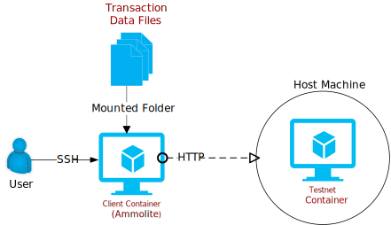

# Connect to the AIO Image

- [Connect to the AIO Image](#connect-to-the-aio-image)
  - [1. Start the Testnet](#1-start-the-testnet)
    - [1.2. Minimum Requirements](#12-minimum-requirements)
    - [1.3. Install the Docker Engine](#13-install-the-docker-engine)
    - [1.4. Download the Image](#14-download-the-image)
    - [1.5. Start the Image](#15-start-the-image)
  - [2. Shut Down the Testnet](#2-shut-down-the-testnet)
    - [2.1. Stop the Contanier](#21-stop-the-contanier)
    - [2.2. Remove the Container](#22-remove-the-container)
  - [3. Troubleshooting](#3-troubleshooting)

## 1. Start the Testnet

The testnet docker container has virtually everything you need to get started. It is probably the easiest way to set up a testnet. 
Users can downlaod our [all-in-one testnet](../../testnet-docker-allinone.md) docker image and then start a one-node testnet localcally. 
The testnet is fully functional.

Once the testnet is running you can start interact with it through standard [Ethereum jason RPC API.](https://github.com/ethereum/execution-apis).
The docker engine is the only thing you will need other than the docker images.



### 1.2. Minimum Requirements

- 2 Cores**
- **16G RAM**
- Docker Engine

### 1.3. Install the Docker Engine

Download and install the docker engine from [here](https://www.docker.com/)

### 1.4. Download the Image

```sh
docker pull cody0yang/cluster:1.13
```

### 1.5. Start the Image

Use the the command below to start the testnet container and map the port `8080` to the host machine. You will need to use the host IP to access the docker container later. Remember, the host machine is the one on which your testnet docker is running. 

The port 7545 is for handling standard Ethereum json rpc calls so users can use the standard Ethereum tools like Truffle, Remix and MetaMask to connect.

```sh
docker run --name allinone-cluster -p 8080:8080 -p 7545:7545 -d cody0yang/cluster:1.13 /root/dstart.sh chainID:100 rpcPort:7545
```


```
docker ps -a
```


> It will take some time for the services to start. Please wait for some time before proceeding to the next steps.

## 2. Shut Down the Testnet

Use the command below the stop the testnet. Please don't try to start a testnet docker while another one is still running. Always stop the running instance first before starting the next one. Otherwise you might have to reinstall the testnet docker.


### 2.1. Stop the Contanier

```sh
sudo docker stop allinone-cluster 
```

### 2.2. Remove the Container

```sh
sudo docker rm allinone-cluster 
```

## 3. [Troubleshooting](./troubleshooting.md)