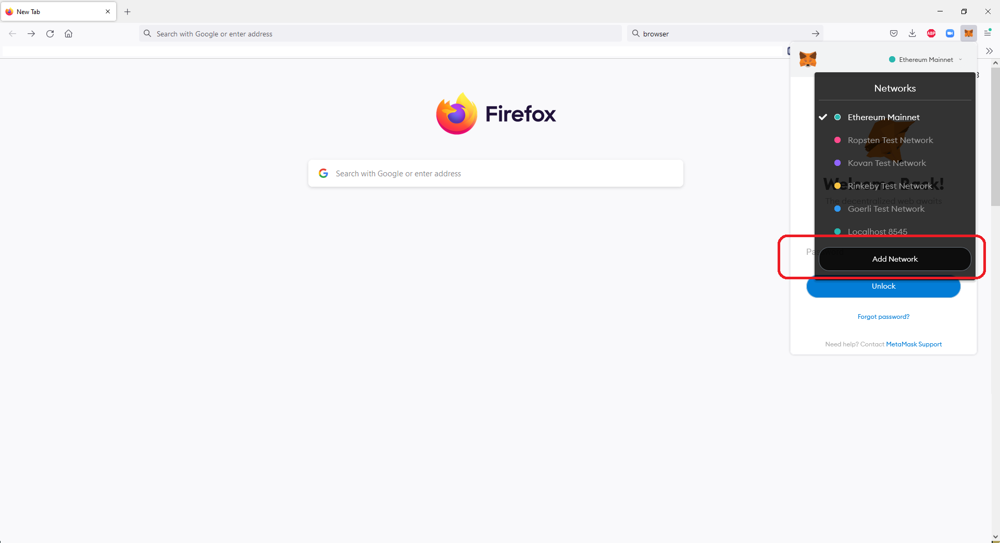
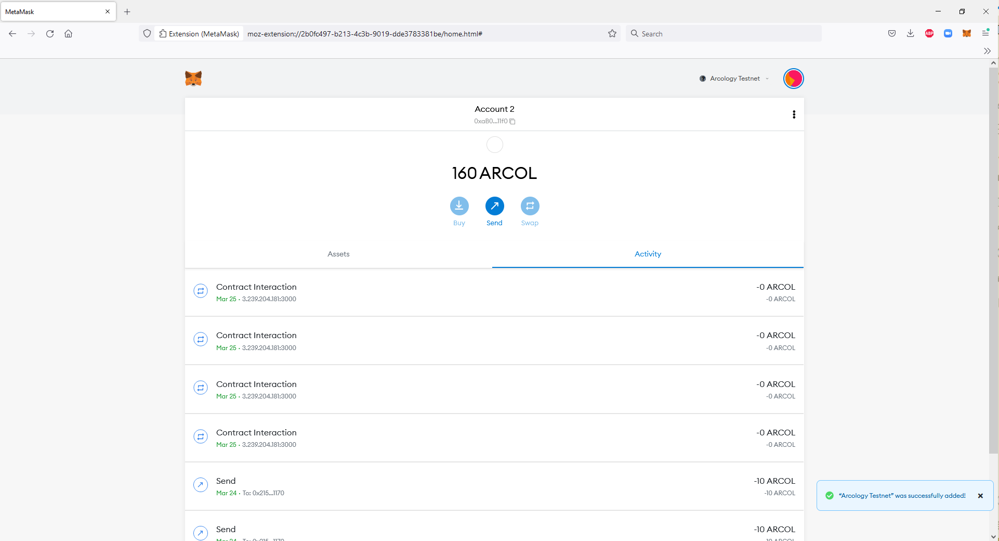

# Start Exploring

## 1. Introduction

Arcology support all Ethereum standard RPC APIs. All Ethereum tools and DApps should work with Arcology seamlessly.

## 2. MetaMask

MetaMask is the most popular Ethereum wallet and is als supported on Arcology. 

### 2.1. Install MetaMask

Download and install MetaMask from https://metamask.io/

### 2.2. Start MetaMask

### 2.3. Add Network

### 2.4. Import Accounts

There are a list of [pre-created accounts](../developers/tutorials/accounts.md) in the docker container with sufficient balanace that developers and can use to initiate transactions instead.

### 2.4. Show Balances

