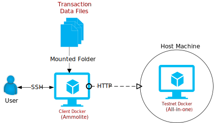

# All in One Installation Guide (v1.1.0)

- [All in One Installation Guide (v1.1.0)](#all-in-one-installation-guide-v110)
  - [Getting Started](#getting-started)
  - [Download the Node Docker](#download-the-node-docker)
  - [Start the Node Docker](#start-the-node-docker)
  - [Download the Client Docker](#download-the-client-docker)
  - [Download the Transaction Data](#download-the-transaction-data)
  - [Start the Client Docker](#start-the-client-docker)
  - [Log in to the Client Docker](#log-in-to-the-client-docker)
  - [Uniswap Showcase](#uniswap-showcase)


## Getting Started

The package has virtually everything you need to start using Acology.It is the easiest way to set up an Arcology testnet. THe docker engine is probably the only thing you will need other than the docker images. There are three major components.

- A Node Docker image
- A Client Docker image
- Some Pregenerated transaction files




## Download the Node Docker

```sh
sudo docker pull cody0yang/cluster:latest
```

## Start the Node Docker

```sh
sudo docker run --name allinone-cluster -p 8080:8080 -d cody0yang/cluster:latest /root/dstart.sh
```

## Download the Client Docker

```sh
sudo docker pull cody0yang/ammolite:latest
```

## Download the Transaction Data

You may download the transaction data file from [here](./pregen_tx.tar). Uncompress the data files into a local folder, you will need to access these files from the client docker container later.

## Start the Client Docker

Ammolite is Arcology's network client package written in Python, so can interact with Arcology nodes through HTTP connections. Ammolite to Arcology is like web3.js to Ethereum. You don't to install the package manually as everything is already set up for you in the client docker container.

```sh
docker run --name ammo -p 32768:22 -v <your transaction file folder>:/root/data  -d cody0yang/ammolite /usr/sbin/sshd  -D
```

## Log in to the Client Docker

You can log in to the docker contain with the credential below.

- Username: **root**
- Password: **frY6CvAy8c9E**

## Uniswap Showcase

The testnet is ready at this point. [This document shows you how to compile, deploy and run Uniswap V2 on the testnet.]((./uniswap-v2.md) )
