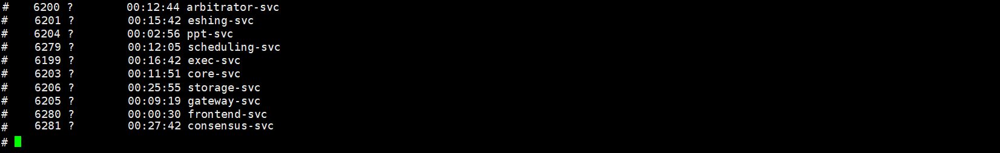

# All-in-One Testnet Docker Guide (v1.1.0)

- [All-in-One Testnet Docker Guide (v1.1.0)](#all-in-one-testnet-docker-guide-v110)
  - [1. Getting Started](#1-getting-started)
    - [1.1. Contents](#11-contents)
    - [1.2. System Requirements](#12-system-requirements)
    - [1.3. **Download the Testnet Docker**](#13-download-the-testnet-docker)
    - [1.4. **Start the testnet Docker**](#14-start-the-testnet-docker)
    - [1.5. **Testnet Docker Status**](#15-testnet-docker-status)
      - [1.5.1. Log in to the Testnet Docker](#151-log-in-to-the-testnet-docker)
      - [1.5.2. Log in to the Testnet Docker](#152-log-in-to-the-testnet-docker)
  - [2. Interact with the Testnet Docker](#2-interact-with-the-testnet-docker)

## 1. Getting Started

The dockers has virtually everything you need to get started. It is probably the easiest way to set up a testnet. THe docker engine is thing you will need other than the docker images.

### 1.1. Contents

There are three major components in the docker package.

- A Testnet Docker image
- A Client Docker image

The transaction data files are pregenerated transaction data to facilite the test. They are part of the testnet installers, which need to be downloaded separately from [here](https://github.com/arcology-network/benchmarking/releases)


### 1.2. System Requirements

- ubuntu 20.04
- Docker Engine

### 1.3. **Download the Testnet Docker**

```sh
sudo docker pull cody0yang/cluster:latest
```

### 1.4. **Start the testnet Docker**

Use the the command below to start the docker container and map the port of your container to the host machine. You will need to use the host IP to access the docker container.

```sh
sudo docker run --name allinone-cluster -p 8080:8080 -d cody0yang/cluster:latest /root/dstart.sh
```

Your client docker should be listening on port 8080 and ready to be connected on your host machine. Again, the host is the machine on which your testnet docker is running.

### 1.5. **Testnet Docker Status**

#### 1.5.1. Log in to the Testnet Docker

```sh
sudo docker exec -it allinone-cluster /bin/sh
```

#### 1.5.2. Log in to the Testnet Docker

Use the command below to check the testnet status.

``` sh
ps -e | grep arbitrator-svc
ps -e | grep eshing-svc
ps -e | grep generic-hashing-svc
ps -e | grep ppt-svc
ps -e | grep scheduling-svc
ps -e | grep exec-svc
ps -e | grep core-svc
ps -e | grep consensus-svc
ps -e | grep storage-svc
ps -e | grep gateway-svc
ps -e | grep frontend-svc
ps -e | grep pool-svc
```

<u>If everything is running properly, you should be able to see a list of running services, which should look like this.</u>



## 2. Interact with the Testnet Docker

Once the testnet docker has been started, it is listening on port 8080 of the host machine and ready to be connected. **[This document describes how to connect to a the testnet docker from a client docker.](./ammolite-client-docker.md)**