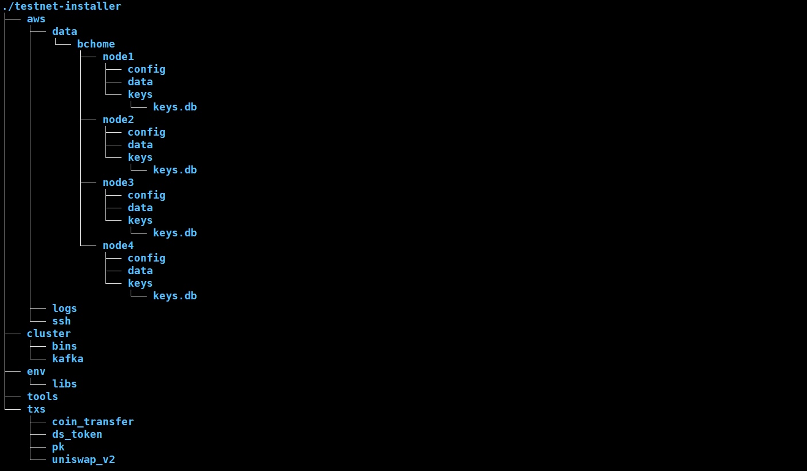
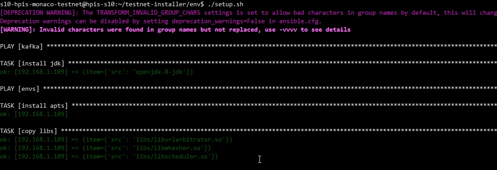
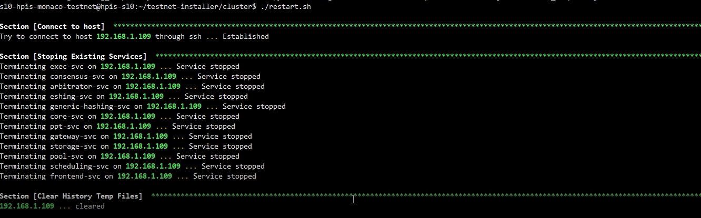

# All-in-One Installation Guide

- [All-in-One Installation Guide](#all-in-one-installation-guide)
  - [1. Introduction](#1-introduction)
  - [2. Installation](#2-installation)
    - [2.1. Prerequisites](#21-prerequisites)
    - [2.2. Download the Installer](#22-download-the-installer)
    - [2.3. The Installer Contents](#23-the-installer-contents)
    - [2.4. Host Information](#24-host-information)
    - [2.5. Update the Installation Files](#25-update-the-installation-files)
    - [2.6. Install Dependencies](#26-install-dependencies)
    - [2.7. Pregenerated Transactions](#27-pregenerated-transactions)
    - [2.8. Starting the Network](#28-starting-the-network)
  - [3. Testnet Client](#3-testnet-client)
    - [Docker container](#docker-container)
    - [3.1. SSH into the docker container](#31-ssh-into-the-docker-container)

## 1. Introduction

This document shows how to start an all-in-one testnet one a local / remote machine. Arcology is a complex system, especially when it comes to the installation. Setting up the testnet is perhaps the most challenging step. Users often get confused about certain procedures.  

The All-in-one helps users to host all the services on a single machine. In many cases, it is going to be a notebook or workstation. So the users won’t bother to go through the cluster setup process first, which is perhaps the most challenging step. The all-in-one installation option trades performance for installation easiness. But it is a perfectly fine option for a beginner to start with.

## 2. Installation


### 2.1. Prerequisites

- ubuntu 20.04
- Python 3.8.10

### 2.2. Download the Installer

Download the [latest installer package](https://github.com/arcology-network/benchmarking/releases) from Arcology’s GitHub repository, then uncompress the package into a directory of your choice. You will need the folder when starting the client container.

### 2.3. The Installer Contents

The installer package has the below structure

- `aws`  folder contains all the files to prepare clusters on Amazon AWS
- `env`  folder contains files and tools to install the envirment on a cluster of machines
- `cluster` folder  has the compiled Arcology service files and tools to start and stop a testnet
- `modifyconfig.sh`  is reposible to generate install configuraiton file based on user information
- `tools` folder has some miscellaneous tools for data preparation and cleaning.



### 2.4. Host Information

Under the testnet-installer directory, update the installation cofiguration file with the command below

```sh
> cd testnet-installer
```

```sh
> ./modifyconf.sh yourhostip yourhostname yourhostpwd yourhostpath
```

### 2.5. Update the Installation Files

For example, suppose your have the following login information

- Host machine ip: 192.168.1.109
- Host username: s9-hpis-monaco-testnet
- Host password: S9@Hpis.Monaco.Testnet
- Home directory on host: /home/s9-hpis-monaco-testnet/
  
```sh
> ./modifyconf.sh 192.168.1.109 s9-hpis-monaco-testnet S9@Hpis.Monaco.Testnet /home/s9-hpis-monaco-testnet/
```

### 2.6. Install Dependencies

```sh
> ./setup.sh
```



### 2.7. Pregenerated Transactions

The package contains some pregenearted transaction files that can be used directly in testing. Run the command below to
copy the files to the host machine.

```
> scp -r ../txs s9-hpis-monaco-testnet@192.168.1.109:/home/s9-hpis-monaco-testnet/
```

### 2.8. Starting the Network

You should be ready to the start the testnet by now.

```sh
> ./restart.sh
```



## 3. Testnet Client

Ammolite is Arcology's network client package written in Python, so can interact with Arcology nodes through HTTP connections. Ammolite to Arcology is like web3.js to Ethereum. You don't to install the package manually as everything is already set up for you in a docker container.

### Docker container

The installation scripts will automatically start a Docker container on the host machine. The container has all the tools and libraries to interact with the Arcology testnet. You can log in to the docker contain with the credential below.

- Username: root
- Password: frY6CvAy8c9E

### 3.1. SSH into the docker container

If your host machine's IP address is 192.168.1.109 then ssh into the client docker container. The testnet is ready at this point

```sh
> ssh -p 32768 root@192.168.1.109
```